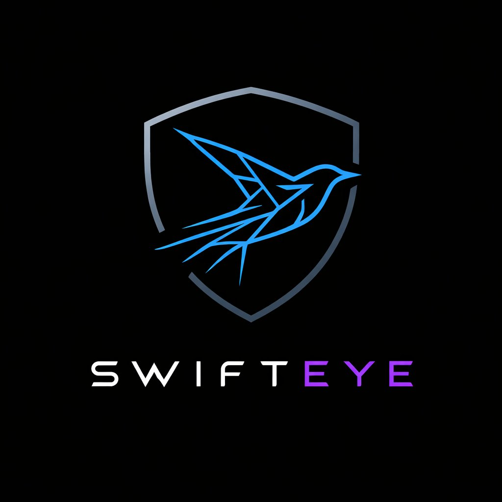

# SwiftEye — Handoff Document
## Version 0.10.4 | March 2026

> **Purpose:** This document is the single context file for any LLM (or human developer) starting a new session on this project. It contains everything needed to understand the project's rules, architecture, current state, known issues, and roadmap — without reading every source file. Changelog history lives in `CHANGELOG.md`.

**Latest version: v0.10.3** — see `CHANGELOG.md` for full version history.

### Recent highlights (v0.10.3)
- Session field explosion refactor: `sessions.py` 884→280 lines, 18 auto-discovered protocol field modules
- Dynamic session detail rendering: `SessionDetail.jsx` 1171→646 lines, 11 auto-discovered section components
- Generic fallback renderer: new backend protocols appear in UI automatically as key-value rows
- DHCP dissector bug fix: scapy BOOTP layer now handled correctly
- JA3/JA4 fingerprints merged into TLS module (was separate file)

### Previous highlights (v0.10.1)
- Zeek multi-log enrichment (dns.log, http.log, ssl.log) with 5-tuple session joining
- Edge session threshold (20 per edge, "Show more" fetches from API)
- Timeline slider debounce, bucket cap (MAX_RAW_BUCKETS=15000)
- Graph node/edge brightness improvements
- QUIC dissector (Phase 1) — Initial packet decryption, SNI/ALPN extraction
- SMTP, mDNS, SSDP, LLMNR, DCE/RPC dissectors
- HTTP User-Agent timeline research chart
- OUI vendor table expanded to ~1050 entries
- Generic keyword search matches session-level fields

<p align="center"></p>

---

## 0. Maintenance Rules

### Git workflow

Every batch of features/fixes goes on a **new branch** (e.g. `feat/smtp-dissector`, `fix/timeline-bug`). Commit work there. Never push directly to main. The developer tests on the branch before merging to main.

### Documentation

Every session that changes features, fixes bugs, or updates the roadmap **must** update all three docs **before** any code changes:

| File | Update when |
|------|-------------|
| `README.md` | Features added/removed, limits change, quick-start steps change |
| `HANDOFF.md` | Bug fixed, roadmap item added/changed, architecture decision made |
| `CHANGELOG.md` | Every version bump — detailed per-version entries live here |
| `docs/DEVELOPERS.md` | API changes, new extension points, architecture changes, new patterns |

**HANDOFF first, always.** The version header, changelog entry, and roadmap tick go in before the first line of code.

---

## 0b. Change Checklists

### Adding a new protocol (port-based detection)
- [ ] `backend/constants.py` — add port → name entry in `WELL_KNOWN_PORTS`
- [ ] `backend/constants.py` — add name → hex colour in `PROTOCOL_COLORS`
- [ ] `frontend/src/components/FilterBar.jsx` — add to `FIELD_SUGGESTIONS` autocomplete
- [ ] `HANDOFF.md` — changelog

### Adding payload signature detection
- [ ] All steps above
- [ ] `backend/parser/protocols/signatures.py` — `@register_payload_signature("MY_PROTO", priority=N)`
- [ ] Priority guide: 10–15 = magic bytes, 20–30 = banner, 40–60 = heuristic

### Adding a protocol dissector
- [ ] All steps from "Adding a new protocol" above
- [ ] `backend/parser/protocols/dissect_<n>.py` — `@register_dissector("MY_PROTO")` returning extra fields dict
- [ ] `backend/parser/protocols/__init__.py` — `from . import dissect_<n>  # noqa: F401`
- [ ] `backend/analysis/protocol_fields/<n>.py` — `init()`, `accumulate(s, ex, is_fwd, source_type)`, `serialize(s)` (auto-discovered, no registration needed)
- [ ] If new `pkt.extra` keys should appear in EdgeDetail — collect them in `aggregator.py` `build_graph()`
- [ ] If those fields should be in the display filter — update `displayFilter.js` FIELDS + eval functions
- [ ] If those fields should autocomplete — add to FilterBar `FIELD_SUGGESTIONS`
- [ ] **Note:** Dissectors using scapy layers (e.g. `pkt.haslayer(DNS)`) only work on the scapy path (files < 500MB). The dpkt path uses `_PayloadProxy` which only handles `"Raw"`. See roadmap for fix.

### Keeping TLS fingerprinting working after adding an HTTPS variant
- [ ] `backend/parser/pcap_reader.py` — add to `_TLS_PROTOCOLS`
- [ ] `backend/parser/dpkt_reader.py` — add to `_TLS_PROTOCOLS` (both files must stay in sync)

### Adding a Graph Options toggle
Graph Options are toggles that reshape how the backend *builds* the graph — they trigger a full `/api/graph` re-fetch.

- [ ] `frontend/src/hooks/useCapture.js` — add `useState` + setter
- [ ] `frontend/src/hooks/useCapture.js` — add param to the graph fetch `useEffect` call and dependency array
- [ ] `frontend/src/api.js` `fetchGraph()` — add to `URLSearchParams`
- [ ] `frontend/src/components/LeftPanel.jsx` — add toggle to Graph Options section (pass value + setter as props via App.jsx)
- [ ] `frontend/src/App.jsx` — pass `c.myToggle` and `c.setMyToggle` as props to LeftPanel
- [ ] `backend/server.py` `/api/graph` — add `Query` param
- [ ] `backend/analysis/aggregator.py` `build_graph()` — add param and implement filter/transform
- [ ] `HANDOFF.md` — changelog + roadmap tick
- [ ] `docs/DEVELOPERS.md` — Graph Options table + API reference

### Adding a backend filter (packet-narrowing, not reshaping)
- [ ] `backend/analysis/aggregator.py` `filter_packets()` — add param and logic here (single source of truth)
- [ ] `backend/analysis/aggregator.py` `build_graph()` — pass through to `filter_packets()`
- [ ] `backend/server.py` `/api/graph` — add `Query` param
- [ ] `frontend/src/hooks/useCapture.js` — add state + pass as graph fetch param + dependency array
- [ ] `frontend/src/api.js` `fetchGraph()` — add to `URLSearchParams`

### Adding an insight plugin
- [ ] `backend/plugins/insights/my_plugin.py` — subclass `PluginBase`, implement `get_ui_slots()` + `analyze_global()`
- [ ] `backend/server.py` `_register_plugins()` — add `("plugins.insights.my_plugin", "MyPlugin")`
- [ ] If per-node IP→data: update `NodeDetail.jsx` to slice the global result to the current node
- [ ] If adds a flat field to graph nodes (like `os_guess`): update `_enrich_nodes_with_plugins()`, `displayFilter.js`, FilterBar `FIELD_SUGGESTIONS`
- [ ] `HANDOFF.md` + `docs/DEVELOPERS.md`

### Adding a graph-wide analysis plugin
- [ ] `backend/plugins/analyses/my_analysis.py` — subclass `AnalysisPluginBase`, implement `compute(ctx)` returning `_display` data
- [ ] `backend/server.py` `_register_analyses()` — add `("plugins.analyses.my_analysis", "MyAnalysis")`
- [ ] No frontend changes needed — the Analysis page renders cards generically from `_display`
- [ ] `HANDOFF.md` + `docs/DEVELOPERS.md`

### Adding a research chart
- [ ] `backend/research/my_chart.py` — subclass `ResearchChart`, implement `compute()`, call `fig.update_layout(SWIFTEYE_LAYOUT)`
- [ ] `backend/server.py` `_register_charts()` — add `("research.my_chart", "MyChart")`
- [ ] `HANDOFF.md` + `docs/DEVELOPERS.md`

### Adding a new API endpoint
- [ ] `backend/server.py` — route function + `_require_capture()` decision (see rule below)
- [ ] `backend/models.py` — Pydantic model if response shape is non-trivial
- [ ] `frontend/src/api.js` — fetch function

**`_require_capture()` rule:**
- **Add it** if the endpoint reads `store.packets/sessions/stats/time_buckets/protocols/subnets/annotations/synthetic/metadata_map`
- **Don't add it** if it reads static server-startup data (plugin registrations, chart registrations, log buffer)

**`.catch()` rule:**
- **Add `.catch(() => fallback)`** only when the endpoint has `_require_capture()` AND it's called at capture-load time in `loadAll()`
- **Don't add** if no guard — errors should surface to the user

### Adding a display filter field
- [ ] `frontend/src/displayFilter.js` — add to `FIELDS` set
- [ ] `frontend/src/displayFilter.js` — add `case` in `evalNodePred()` and/or `evalEdgePred()`
- [ ] `frontend/src/components/FilterBar.jsx` — add to `FIELD_SUGGESTIONS` and help table

---

## 1. Project Vision

SwiftEye is a **network traffic visualization platform for security researchers**.

**Core philosophy: viewer, not analyzer.** The core platform shows what's in the data. Researchers bring the expertise. The core viewer and analysis layers never make security judgments — they present evidence. Threat detection, alerting, and security scoring belong in the plugin system (analyses tier), where they can correlate across sessions and nodes without polluting the core.

The boundary: if it's displaying what's in the packet → core viewer. If it requires correlation, inference, or domain knowledge → plugin.

**Zero data loss principle.** Never discard raw data to create a cleaner view. Aggregation (sessions, graphs, statistics) adds zoom levels on top of the data — it never replaces it. The researcher must always be able to drill from aggregated view → individual packets → raw bytes without hitting a wall. Many security platforms decide what's "interesting" for the researcher; SwiftEye helps the researcher visualize data so they can form hypotheses they wouldn't have otherwise, while preserving full access to the underlying raw data.

### Zero Data Loss — Current Violations & Execution Plan

The codebase has two categories of violations against this principle:

**Violation 1: Silent caps at the accumulation layer.**
Every `CAP_*` constant in `analysis/protocol_fields/*.py` permanently discards data. A session with 80 HTTP URIs silently keeps 30 and throws away 50. The researcher has no idea data was lost and can't drill down to find it. Dissector-level caps (`min(dns.ancount, 20)` in `dissect_dns.py`) are worse — the data never even enters the session. String truncation in dissectors (User-Agent at 200 chars, SSDP fields at 300 chars) silently clips fields with no indication.

**Violation 2: Data noise from eager protocol init.**
`all_init()` runs every protocol field initializer on every session, even ones that never see that protocol. A pure TCP file transfer gets `smtp_has_auth: False`, `dns_queries: []`, `kerberos_error_codes: []`, etc. — 18 protocols worth of empty fields. This is the opposite problem: showing the researcher things that aren't in the data. It caused the fallback renderer bugs (SMTP appearing on DHCP sessions) and makes session objects harder to inspect.

**Execution plan (in order):**

| Step | What | Where | Risk |
|------|------|-------|------|
| 1 | Remove dissector-level record caps | `dissect_dns.py`, `dissect_tls.py` | Low — only affects field count, not parsing logic |
| 2 | Lazy protocol init | `protocol_fields/*.py` `init()` → called on first `accumulate()` per session | Medium — must verify all `serialize()` functions handle missing keys gracefully |
| 3 | Remove `CAP_*` from accumulation | `protocol_fields/*.py` accumulate functions | Medium — memory grows unbounded per session |
| 4 | Add caps at serialization with `_total` counts | `protocol_fields/*.py` serialize functions | Low — display-only change |
| 5 | Add truncation indicators for strings | `dissect_http.py`, `dissect_smtp.py`, `dissect_ssdp.py` | Low — append `…` or add `_truncated: true` |
| 6 | Frontend "X of Y" display + expand | `session_sections/*.jsx`, `EdgeDetail.jsx` | Low — UI-only |

**Pitfalls & tradeoffs (memory/compute vs. philosophy):**

- **Memory pressure on large captures.** The whole reason caps exist is that a 500MB pcap can produce sessions with thousands of HTTP URIs or DNS queries. Removing accumulation caps means session objects can grow much larger in memory. For a desktop tool this is a real constraint — a 2M-packet capture with heavy HTTP traffic could balloon session memory by 5-10x on the worst sessions. *Mitigation:* keep a **generous** cap (e.g. 500 per list field, 2000 chars per string) as a safety valve, but set it high enough that no realistic investigation hits it, and always include `_total` so the researcher knows. The raw pcap is the escape hatch for anything beyond the cap.
- **Serialization payload size.** Sending uncapped lists to the frontend means larger JSON payloads on session detail requests. A session with 500 DNS queries × ~200 bytes each = ~100KB just for that field. *Mitigation:* paginate at the API level — the session detail endpoint already accepts `packet_limit`; extend this pattern to protocol fields. Return the first N items + `_total`, with a `?field_offset=N` param to fetch more.
- **Lazy init complicates serialize().** If a protocol's fields were never initialized (no packets seen), `serialize()` must either not be called or handle `KeyError` gracefully. Currently `all_serialize()` calls every protocol's `serialize()` unconditionally. *Mitigation:* track which protocols have been initialized per session (a `set` on the session dict, e.g. `s['_active_protocols']`), and only call `serialize()` for those.
- **Edge aggregation is a separate problem.** `aggregator.py` re-caps TLS ciphers and DNS queries at the edge level. Edges aggregate across many sessions, so uncapping here has a multiplicative effect. *Mitigation:* edges are summary views by nature — capping at the edge display layer is philosophically fine as long as the researcher can drill into individual sessions to see everything. Document this distinction.
- **Stats top-N is not a violation.** `TOP_TALKERS=15` in `stats.py` is aggregation that adds a zoom level. The underlying session data still has every IP. The researcher can always drill down. Same for timeline bucketing. These stay as-is.
- **Resource guards are not violations.** `MAX_FILE_SIZE`, `MAX_PACKETS`, `MAX_RAW_BUCKETS` protect the tool from choking. They are explicit boundaries, not silent discarding. These stay as-is.

---

## 2. Architecture

```
swifteye/
├── backend/
│   ├── server.py                    # FastAPI, CaptureStore, orchestration, annotations, synthetic
│   ├── constants.py                 # Single source of truth: PROTOCOL_COLORS, WELL_KNOWN_PORTS,
│   │                                #   TCP_FLAG_NAMES/BITS, ICMP_TYPES, CIPHER_SUITES, SWIFTEYE_LAYOUT
│   ├── models.py                    # Pydantic API response models
│   ├── parser/
│   │   ├── packet.py                # PacketRecord dataclass (normalised packet)
│   │   ├── pcap_reader.py           # Router: <500MB → scapy (full dissection), ≥500MB → dpkt (partial)
│   │   ├── dpkt_reader.py           # dpkt path for very large files. NOTE: dissectors using scapy
│   │   │                            #   layers (DNS, etc.) return empty on this path. See roadmap.
│   │   ├── oui.py                   # MAC vendor lookup (~700 OUI entries)
│   │   ├── ja3_db.py                # JA3 hash → {name, category, is_malware} (~60 entries)
│   │   └── protocols/
│   │       ├── __init__.py          # Registries, resolution, auto-imports dissectors
│   │       ├── signatures.py        # Payload signature matchers
│   │       ├── dissect_dns.py       # DNS (scapy layer — only works on scapy path)
│   │       ├── dissect_http.py      # HTTP (scapy + manual fallback)
│   │       ├── dissect_tls.py       # TLS (scapy + manual fallback)
│   │       ├── dissect_icmp.py      # ICMP/ICMPv6 type/code resolver
│   │       ├── dissect_ssh.py       # SSH banner
│   │       ├── dissect_ftp.py       # FTP commands/credentials
│   │       ├── dissect_dhcp.py      # DHCP hostname/vendor class
│   │       └── dissect_smb.py       # SMB v1/v2/v3 share paths/filenames
│   ├── analysis/
│   │   ├── aggregator.py            # filter_packets(), build_graph(), entity_map, OUI+JA3 lookup
│   │   │                            #   IPv6 filter uses resolved IPs when entity_map active
│   │   ├── sessions.py              # Session reconstruction, directional metrics, all protocol fields
│   │   └── stats.py                 # Global statistics
│   ├── plugins/
│   │   ├── __init__.py              # PluginBase, registry, display helpers, UISlot system
│   │   ├── insights/                # Per-node/per-session interpretation
│   │   │   ├── os_fingerprint.py    # Passive OS detection from SYN/SYN+ACK
│   │   │   ├── tcp_flags.py         # TCP sender attribution
│   │   │   ├── dns_resolver.py      # IP → hostname from captured DNS responses
│   │   │   ├── network_map.py       # ARP table, gateway detection, LAN hosts
│   │   │   ├── node_merger.py       # Pre-aggregation: merge IPs by MAC into one node
│   │   │   └── network_map.py      # ARP table, gateway detection, LAN hosts
│   │   └── analyses/                # Graph-wide computation
│   │       ├── __init__.py          # AnalysisPluginBase, registry, run_all_analyses()
│   │       ├── node_centrality.py   # Degree + betweenness + traffic-weighted ranking
│   │       └── traffic_characterisation.py  # Session fg/bg/ambiguous classification
│   ├── tests/                       # Pytest test suite
│   │   └── test_core.py             # Core path + regression + plugin tests
│   └── research/
│       ├── __init__.py              # ResearchChart base, Param, registry, run_chart()
│       ├── conversation_timeline.py
│       ├── ttl_over_time.py
│       ├── session_gantt.py
│       └── seq_ack_timeline.py      # SEQ/ACK scatter — also called inline from SessionDetail
├── frontend/
│   └── src/
│       ├── version.js               # VERSION = '0.9.1' — ONLY place to update version
│       ├── App.jsx                  # Pure layout. Calls useCapture(), decides right-panel content
│       ├── hooks/useCapture.js      # ALL capture state, effects, fetches, handlers
│       ├── api.js                   # All backend calls
│       ├── displayFilter.js         # Wireshark-style filter parser + client-side evaluator
│       └── components/
│           ├── GraphCanvas.jsx      # D3 force graph on canvas + annotation overlays
│           ├── TopBar.jsx           # Logo, filename, search, theme toggle, META/settings button
│           ├── FilterBar.jsx        # Display filter bar with autocomplete + OS chips
│           ├── LeftPanel.jsx        # Protocols, Graph Options, panel switcher
│           ├── NodeDetail.jsx       # Node info: IPs+MACs+vendors, OS fingerprint, notes
│           ├── EdgeDetail.jsx       # Edge info: TLS (JA3/JA4), protocol conflicts
│           ├── SessionDetail.jsx    # Session: overview/flags/seq-ack/packets/payload tabs
│           ├── SessionsTable.jsx    # Sessions list with local search + sort
│           ├── MultiSelectPanel.jsx # Panel shown when 2+ nodes selected
│           ├── StatsPanel.jsx       # Traffic Map panel (default right panel)
│           ├── ResearchPage.jsx     # Full-width research charts page
│           ├── TimelinePanel.jsx    # Full-width Gantt page
│           ├── AnalysisPage.jsx     # Full-width analysis page (backend-rendered cards)
│           ├── VisualizePage.jsx   # Custom data graph (CSV/TSV/JSON upload + column mapping)
│           ├── HelpPanel.jsx        # Help panel: Guide + Plugins & Protocols tabs
│           ├── SettingsPanel.jsx    # Settings panel: theme picker, LLM API key
│           ├── LogsPanel.jsx        # Server log viewer (polls /api/logs)
│           ├── PluginSection.jsx    # Generic plugin UI slot renderer + dedicated renderers
│           ├── Sparkline.jsx        # Canvas sparkline with active range highlight
│           ├── Collapse.jsx         # Collapsible section primitive
│           ├── Tag.jsx              # Protocol/status tag chip
│           ├── FlagBadge.jsx        # TCP flag badge
│           └── Row.jsx              # Layout row primitive
└── requirements.txt
```

### Key Architectural Rules (MUST NOT VIOLATE)

- `visibleNodes`/`visibleEdges` MUST be `useMemo`-ed in `useCapture.js` — never inline `.filter()` in JSX (causes simulation restart on every render)
- `_require_capture()` only on endpoints reading per-capture store fields — never on static startup data
- `store.annotations/synthetic/metadata_map` are cleared in `store.load()` on every new upload
- `VERSION` string lives only in `frontend/src/version.js` — imported everywhere else
- All state/logic in `useCapture.js`, App.jsx is pure layout only
- HANDOFF updated FIRST before any code changes
- `mac_vendors` derived as `[lookup_vendor(mac) for mac in sorted(n["macs"])]` at serialisation — parallel to `macs`
- IPv6 filter in `build_graph`: when `entity_map` active + `include_ipv6=False`, check resolved IPs not raw packet IPs

### API Endpoints

| Method | Endpoint | Params / Notes |
|--------|----------|----------------|
| POST | `/api/upload` | Multipart pcap file |
| GET | `/api/status` | Capture loaded status, filename |
| GET | `/api/stats` | Global capture statistics |
| GET | `/api/timeline` | `bucket_seconds` — time-bucketed packet counts |
| GET | `/api/graph` | `time_start`, `time_end`, `protocols`, `search`, `subnet_grouping`, `subnet_prefix`, `merge_by_mac`, `include_ipv6`, `show_hostnames`, `subnet_exclusions` |
| GET | `/api/sessions` | `limit`, `search` — session list |
| GET | `/api/session_detail` | `session_id`, `packet_limit` |
| GET | `/api/protocols` | Protocol list + colours |
| GET | `/api/subnets` | Subnet groupings |
| GET | `/api/slice` | `time_start`, `time_end`, `protocols`, `search`, `include_ipv6` — binary pcap download |
| GET | `/api/plugins` | Plugin UI slot declarations (no capture required) |
| GET | `/api/plugins/results` | All global plugin results |
| GET | `/api/research` | List registered charts (no capture required) |
| POST | `/api/research/{name}` | Run chart — body: `{params..., _timeStart?, _timeEnd?}` |
| GET/POST/DELETE | `/api/metadata` | Researcher metadata JSON |
| GET/POST | `/api/annotations` | Annotation CRUD |
| PUT/DELETE | `/api/annotations/{id}` | Update/delete annotation |
| GET/POST | `/api/synthetic` | Synthetic node/edge CRUD |
| PUT/DELETE | `/api/synthetic/{id}` | Update/delete synthetic element |
| DELETE | `/api/synthetic` | Clear all synthetic elements |
| GET | `/api/hostnames` | DNS-resolved hostname map |
| GET | `/api/logs` | Server log buffer |

---

## 3. Scalability

The fundamental challenge for a project like SwiftEye is that network captures can produce extremely large graphs. A 10-minute corporate capture can contain hundreds of thousands of packets across thousands of unique IP pairs. Naively rendering this as a force-directed graph would be both computationally prohibitive and visually useless — a dense hairball where nothing is readable. SwiftEye addresses this at both the visualization layer and the compute layer.

### Visualization-side strategies

These reduce what the user *sees* without losing data. The full capture is always available — the researcher narrows their view to what matters.

| Strategy | Status | How it helps |
|----------|--------|-------------|
| **Timeline time slider** | ✅ Implemented | The gap-split sparkline with Start/End sliders lets the researcher scope the entire view (graph, sessions, stats) to a specific time window. A 2-hour capture with a 30-second window of interest becomes manageable. Burst snap buttons auto-detect activity clusters. |
| **Subnet grouping** | ✅ Implemented | Collapses individual IPs into `/N` subnet nodes (configurable /8–/32). A /24 with 200 hosts becomes one node. Right-click any subnet node to uncluster just that subnet — selective expansion without losing the grouped view elsewhere. |
| **Protocol filter** | ✅ Implemented | Protocol checkboxes in the left panel. Uncheck DNS and ARP to remove the noisy service traffic, leaving only the application-layer conversations visible. |
| **Display filter** | ✅ Implemented | Wireshark-style expression filter (`ip`, `port`, `protocol`, `tls.sni`, `os`, `subnet`, CIDR, `&&`/`||`/`!`). Client-side, instant. Researchers can drill down to exactly the traffic they care about without waiting for a backend round-trip. |
| **Merge by MAC** | ✅ Implemented | Dual-stack hosts (IPv4 + IPv6 on the same MAC) collapse into a single node. On networks with heavy IPv6, this can halve the visible node count while preserving all connection data. |
| **Search filter** | ✅ Implemented | Universal keyword search that filters both graph and sessions. Matches IPs, MACs, hostnames, protocols, ports, and TCP flags simultaneously. |
| **Investigate neighbours** | ✅ Implemented | Right-click a node → "Investigate neighbours" (depth-1) or "Investigate component" (full BFS). Isolates the relevant subgraph without manually filtering. |
| **Hide node** | ✅ Implemented | Right-click → Hide. Removes noisy nodes (broadcast addresses, multicast) from the view. Unhide all badge to restore. |
| **Label threshold** | ✅ Implemented | Configurable minimum connection count for node labels. Low-connection nodes render without labels, reducing visual clutter at low zoom. |
| **Large graph layout** | ❌ Not yet | For 1000+ node graphs, the D3 force simulation is slow to converge. Candidate approaches: WebGL renderer (e.g. pixi.js or deck.gl), level-of-detail rendering (show subnet hulls when zoomed out, expand to individual nodes on zoom), or server-side layout computation with pre-positioned coordinates. |

### Compute-side strategies

These reduce processing time and memory usage for large captures.

| Strategy | Status | How it helps |
|----------|--------|-------------|
| **Dual parser (scapy / dpkt)** | ✅ Implemented (threshold issue) | `pcap_reader.py` routes files: <500MB → scapy (full dissection with all protocol layers), ≥500MB → dpkt (lightweight C-based parsing, partial dissection). Currently `DPKT_THRESHOLD == MAX_FILE_SIZE == 500MB`, so dpkt is effectively never used. Once dpkt dissector parity is confirmed, the threshold will be lowered to ~50MB so most captures benefit from dpkt's speed. |
| **Backend-computed analyses** | ✅ Implemented | Node centrality (Brandes betweenness) and traffic characterisation run in Python on the server, not client-side JavaScript. The frontend receives pre-computed results. This moves O(V³) computation off the browser. |
| **Packet-based session scoping** | ✅ Implemented | Time-range filtering uses strict packet timestamps, not session overlap checks. Only sessions with actual packets in the window are included. This avoids the combinatorial blowup of including long-running sessions in every narrow window. |
| **Lazy analysis execution** | ✅ Implemented | Analyses (centrality, traffic characterisation) run lazily on the first graph build, not at upload time. This avoids blocking the upload response for large captures. |
| **Multi-threaded pcap parsing** | ❌ Not yet | Each packet is parsed independently (no cross-packet state in the parser layer), so parsing is embarrassingly parallel. Planned approach: split the raw packet iterator into N chunks, parse each in a `ProcessPoolExecutor`, concatenate and sort by timestamp. Scapy's GIL-bound layer construction needs multiprocessing (not threads); dpkt may benefit from threads. Prerequisites: profiling to confirm the parser is the bottleneck. |
| **Streaming / chunked parse** | ❌ Not yet | Currently the entire packet list is built in memory before any processing begins. For very large captures (>500MB), a streaming approach would emit `PacketRecord` objects as they are parsed, feeding them into sessions/graph incrementally. Requires rearchitecting `build_sessions()` and `build_graph()` to accept iterators instead of lists. |
| **Indexed packet store** | ❌ Not yet | Full-list scans (e.g. `filter_packets()` iterating all packets) are O(N) on every API call. For captures above ~500K packets, an indexed store keyed by `session_key`, `src_ip`, `dst_ip`, and time range would enable O(1) lookups. Candidate: sorted arrays with bisect, or an embedded database (SQLite). |
| **Neo4j graph backend** | ❌ Not yet | Replace in-memory node/edge dicts with Neo4j. Benefits: Cypher queries replace Python loops, native graph storage survives restarts, enables multi-capture persistence and cross-capture queries. Architecture: keep in-memory as fallback via `SWIFTEYE_GRAPH_BACKEND=neo4j|memory`. Prerequisites: large pcap support profiling first. Long-term. |
| **dpkt dissector parity** | ❌ Partially done | DNS, FTP, DHCP, SMB have raw-byte parsers that work on both paths. HTTP/TLS/SSH have manual fallbacks. But scapy-specific dissectors (e.g. `pkt.haslayer(DNS)`) still return empty on the dpkt path. Full parity needed before lowering the dpkt threshold. |

### The practical outcome

For a typical security research capture (10–60 minutes, 50K–500K packets, 50–500 unique IPs), SwiftEye renders a usable graph in under 5 seconds. The researcher narrows it further with time scoping, protocol filters, and subnet grouping — usually arriving at a 20–50 node subgraph within 30 seconds of loading. The scalability strategies exist to push this boundary higher, but the current architecture is designed around the principle that **the researcher's first action is always to scope down**, and the tool should make scoping fast and intuitive.

---

## 4. Current Features

### Core Viewer
- [x] Pcap/pcapng: scapy for <500MB (full dissection), dpkt for ≥500MB (partial); max 500MB
- [x] Multi-pcap: drop multiple files at once; merged by timestamp
- [x] Three-tier protocol detection: port → scapy layers → payload signatures; conflicts flagged
- [x] ~90 well-known port mappings; payload signatures for TLS, HTTP, SSH, SMTP, FTP, DHCP, SMB
- [x] Dissectors: DNS, HTTP, TLS, ICMP/ICMPv6, SSH, FTP, DHCP, SMB
- [x] JA3 + JA4 TLS fingerprints; JA3 → app name lookup (browser/tool/malware); red badge for malware
- [x] MAC vendor lookup (~700 OUI entries); displayed in NodeDetail Advanced section
- [x] Force-directed graph on canvas (D3); multi-edge (one edge per protocol pair)
- [x] Shift+click multi-select with scoped statistics
- [x] Lasso select: Shift+right-drag draws selection rectangle; releases selects all nodes inside
- [x] Backend filters: time range, protocol, search, subnet grouping (/8–/32), Merge by MAC, Show IPv6, Show hostnames
- [x] Subnet uncluster: right-click subnet node → expand to individual IPs; re-clustering works correctly
- [x] Wireshark-style display filter (client-side): ip, port, protocol, tls.sni, os, private, CIDR, role, gateway, &&/||/!
- [x] Investigation mode: "Investigate neighbours" (depth-1) or "Investigate component" (full BFS connected component)
- [x] Relayout button: unpins all nodes and reheats D3 simulation for a clean redistribution
- [x] Synthetic cluster: select 2+ nodes → right-click canvas → cluster into one purple node; edges rerouted automatically
- [x] Node detail: IPs + MACs (with vendor), OS fingerprint, hostnames, connections by direction, researcher notes
- [x] Session detail: overview / flags / SEQ/ACK (inline chart) / packets / payload tabs
- [x] SEQ/ACK Timeline: inline Plotly chart in Session Detail; also available in Research page
- [x] Timeline sparkline: 5s/15s/30s/60s buckets, Start/End range sliders
- [x] Session Gantt: full-width Plotly page (Timeline nav)
- [x] Research page: full-width Plotly charts with time scope (Conversation Timeline, TTL over time, Seq/Ack, DNS Timeline, JA3 Timeline, JA4 Timeline)
- [x] Annotations: right-click canvas/node/edge → pinned labels; persist across reloads; cleared on new upload
- [x] Synthetic nodes/edges: right-click → dashed rendering with ✦ marker; custom colour/size/notes; persisted
- [x] Payload preview: hex+ASCII dump in Session Detail Payload tab
- [x] PCAP export: "Export pcap" button downloads current filtered view
- [x] Hide node: right-click → hide; badge with Unhide all
- [x] Researcher metadata: META button → JSON upload; name becomes node label
- [x] 8 themes: dark (default), dark-blue, oled, colorblind, blood, amber, synthwave, pastel
- [x] Settings panel: theme picker, LLM API key + model (persisted in localStorage)
- [x] Analysis panel: "Analysis ✦" nav; Coming Soon cards (Node Centrality, Traffic Characterisation); LLM interpretation skeleton (API key, model selector, disabled button)
- [x] Resizable right panel (220–600px); Help panel with tabbed Guide + Plugins & Protocols

### Plugin System
- [x] OS Fingerprint — TTL, window size, MSS, TCP options from SYN/SYN+ACK
- [x] TCP Flags — sender attribution (who initiated, closed, reset)
- [x] DNS Resolver — IP → hostname from captured DNS responses; hostnames become node labels
- [x] Network Map — ARP table, gateway detection (diamond shape), LAN hosts, hop estimation
- [x] Node Merger — merge IPs sharing a MAC (including dual-stack) before graph building

### Research Charts
- [x] Conversation Timeline — peers of target IP over time, dot size = bytes
- [x] TTL over time — TTL between two peers, both directions
- [x] Session Gantt — all sessions Gantt (Timeline page)
- [x] Seq/Ack Timeline — TCP seq/ack scatter per session; also inline in SessionDetail SEQ/ACK tab
- [x] DNS Timeline — DNS queries over time by IP
- [x] JA3 Timeline — JA3 fingerprint events over time
- [x] JA4 Timeline — JA4 fingerprint events over time
- [x] HTTP User-Agent Timeline — HTTP requests over time by source IP, coloured by User-Agent

---

## 5. Known Bugs / Architecture Notes

### Open
- **OS filter "network device (likely)" doesn't match gateway/router** — the OS fingerprint plugin produces the guess "network device (likely)" but the display filter/OS dropdown doesn't match nodes identified as gateway/router by the network_map plugin. The two plugins produce independent results — OS fingerprint looks at TTL/window/MSS while network_map looks at ARP/gateway behaviour. The filter should recognise gateway nodes as matching the "network device" filter.
- **Windows OS filter incorrect** — the OS fingerprint `os contains "Windows"` filter does not correctly match all Windows-detected nodes. Likely a casing or substring issue in the display filter evaluator or the OS guess string format. Needs investigation.
- **Visualize time slider re-renders graph during drag** — the time window slider in the Visualize panel rebuilds the graph on every slider move via `useMemo`. It should debounce or require a "Run" button press like the Timeline panel does.
- **`get_packets_for_session()` in CaptureStore** — serialisation logic that belongs in `analysis/sessions.py`. Low priority, no user impact.
- **`_looks_like_ip_keyed()` heuristic** — fragile sampling of plugin result dict keys. Right fix: `slot_data_type: "ip_map" | "global"` on UISlot. Low breakage risk with existing plugins.
- ~~**DHCP dissector misses scapy-parsed packets**~~ — fixed in v0.10.3. Dissector now checks `pkt.haslayer(BOOTP)` first, falls back to Raw.
- **asyncio `_call_connection_lost` error on Windows** — `ProactorBasePipeTransport._call_connection_lost()` raises an exception during `socket.shutdown(SHUT_RDWR)`. Appears in server logs as `[ERROR] asyncio: Exception in callback`. Likely a Python 3.14 / Windows asyncio proactor issue when the client disconnects before the response completes. No user impact (request still completes with 200 OK). Low priority.
- **dpkt dissector parity** — partially addressed in v0.9.15 (DNS, FTP, DHCP, SMB now have raw-byte parsers). HTTP/TLS/SSH already had manual fallbacks. However, DPKT_THRESHOLD == MAX_FILE_SIZE == 500MB means dpkt is effectively never used (files ≥500MB are rejected first). Roadmap: lower DPKT_THRESHOLD to ~50MB once parity is confirmed. The raw-byte parsers are ready.

### Fixed in v0.9.4
- **Seq/Ack chart: two modes** — "Bytes/time" (SEQ relative to ISN vs seconds, lines+markers, slope = throughput) and "SEQ/ACK" (relative SEQ vs relative ACK, scatter, diagonal = healthy flow). Toggle buttons switch mode and clear the figure so Run re-fetches. Legend moved to horizontal below the chart (`y: -0.2`) to stop covering the data.
- **Seq/Ack panel auto-widens** — opening the SEQ/ACK tab calls `onTabChange` → App.jsx widens panel to 500px if narrower. `setPanelWidth` exported from `useCapture`.
- **IPv4/IPv6 header collapse in session overview** — new "IPv4 Header" / "IPv6 Header" collapse after TTL, showing: IP version, DF flag, DSCP with named values (EF=voice, AF classes, CS classes), ECN decoded (ECT0/ECT1/CE), IPv6 flow label. Aggregated in `sessions.py` as `ip_version`, `dscp_values`, `ecn_values`, `df_set`, `ip6_flow_labels` (all set → sorted list). IPv6 traffic class decoded identically to IPv4 ToS (upper 6 bits = DSCP, lower 2 = ECN).
- **Payload tab: ASCII-only default, Hex toggle, copy buttons** — hex bytes hidden by default, "Hex" toggle shows `offset hex ascii`. Per-packet copy buttons: ASCII (printable chars joined), Hex (formatted dump), Raw (plain hex string for CyberChef/piping). `payload_bytes` field added to `get_packets_for_session`.
- **IP header fields per packet in Payload tab** — each packet row shows TTL, DF/MF flags, DSCP, ECN, TCP checksum inline. IPv6 rows show hop limit, DSCP, ECN, flow label.
- **ISN per direction in Advanced** — `seq_isn_init` / `seq_isn_resp` tracked in `sessions.py`, shown in Advanced section for context when reading the relative chart.
- **New `PacketRecord` fields** — `ecn`, `ip_checksum`, `tcp_checksum`, `ip6_flow_label`. Scapy reader populates all; IPv6 traffic class decoded to `dscp`/`ecn` same as IPv4.
- **Seq/Ack chart: layout fix** — corrupted layout block from prior session cleaned up. Both modes use a shared layout with dynamic axis titles.

### Fixed in v0.9.3
- **Payload tab: "Raw bytes" toggle** — hex dump is now hidden by default. A "Raw bytes" toggle button reveals it. Packet rows always show: direction, size, TTL, DF/MF flags, DSCP, ECN, flow label (IPv6), and TCP checksum — the useful header info at a glance without the noise.
- **IP header fields per packet** — both IPv4 and IPv6 fields now extracted and shown inline on each packet row in the Payload tab: IPv4: TTL, DF/MF flags, DSCP, ECN, checksum; IPv6: hop limit, DSCP, ECN, flow label. New `PacketRecord` fields: `ecn`, `ip_checksum`, `tcp_checksum`, `ip6_flow_label`. Scapy reader populates all of them; dpkt reader gets them where available.
- **Advanced: ISN per direction** — `seq_isn_init` and `seq_isn_resp` now tracked in `sessions.py` (first SEQ seen from each direction). Shown in the Advanced section of overview so the relative seq/ack chart can be understood in context: "initiator started at seq 1,234,567,890, which is 0 on the chart".
- **Seq/Ack chart redesigned** — now plots relative SEQ vs time (seconds from session start) instead of raw SEQ vs ACK. Raw TCP ISNs are arbitrary 32-bit values that make the chart unreadable. Relative values show throughput (slope), stalls (flat), retransmits (backward step).
- **Empty protocol in left panel** — packets with empty `protocol` string (from fallthrough in certain dissectors) were showing as a nameless swatch in the protocol list. Filtered in `server.py` at store.protocols build time, and in `LeftPanel.jsx` before render.
- **FLAGS tab removed** — flag counts moved into the Advanced collapse in Overview. Tabs are now: OVERVIEW / SEQ/ACK / PAYLOAD / PACKETS.

### Fixed in v0.9.2
- **Merge-by-MAC gateway bug (critical)** — `build_entity_map` was using both `src_mac`
  AND `dst_mac`. The `dst_mac` of outbound packets is the gateway MAC, not the remote
  host. All external IPs that replied through the same router shared the router MAC as
  `src_mac` and union-found into one node, collapsing all external connections.
  Three-layer fix: (1) src_mac only, (2) skip infrastructure vendor MACs (Cisco, Juniper,
  Aruba, Ubiquiti, Palo Alto, Fortinet, Sophos, WatchGuard, Brocade, Extreme, Arista,
  MikroTik, Ruckus, Meraki) via `_is_router_mac()` + OUI lookup, (3) cap groups at 8 IPs.
- **NodeDetail: IPs and MACs always visible** — moved from collapsed Advanced to top-level.
  MACs show vendor inline: `c4:d0:e3:8f:6b:69 (Apple)`. Advanced now has TTLs only.
- **JA3/JA4 inline** — app name on same line as hash in a coloured pill. SessionDetail
  now uses `JA3Badge` (was rendering plain text with no app lookup). Both files identical.

### Fixed in v0.9.1 (this session)
- **mac_vendors never populated** — lookup was imported but never called; parallel array assumption also wrong. Fixed: derived as `[lookup_vendor(mac) for mac in sorted(n["macs"])]` at serialisation.
- **8 malformed OUI keys** — 7–8 char keys that never matched any MAC. Removed.
- **10 duplicate/conflicting JA3 hashes** — real browser hashes (Chrome, Safari, LibreSSL, Tor) overwritten with malware labels (Dridex, Trickbot, Cerberus, NanoCore, etc.) because Python dicts take the last entry. Conflicting malware entries removed.
- **DNS hostnames not showing** — root cause: dpkt was used for files ≥20MB; DNS dissector uses `pkt.haslayer(DNS)` (scapy layer), returns `{}` on dpkt path. Fixed by raising threshold to 500MB so almost all real captures use scapy.
- **IPv6 connections lost when Merge by MAC + Show IPv6 OFF** — `include_ipv6=False` filter ran before entity resolution. A packet from `2a0d:6fc0::1` (local IPv6, resolves to `192.168.1.177`) to `2606:4700::` was dropped because raw src has ':'. Fix: when entity_map active, filter on resolved IPs; only drop when both resolved endpoints are IPv6.
- **Annotations/synthetic/metadata not cleared on new upload** — `store.load()` now resets all three.
- **Research/Timeline rendered in right panel** — fixed in App.jsx rewrite.
- **`prefillValues` missing from ChartCard props** — chart params didn't pre-fill from session link.
- **Hardcoded version strings** in TopBar/HelpPanel — now use `VERSION` from `version.js`.
- **Dead `hiddenNodes` prop on GraphCanvas** — hidden nodes filtered before being passed, prop was ignored. Removed.
- **`mac_vendors` parallel array wrong** — was a `set()` that never sorted in correspondence with `macs`. Fixed.
- **ICMPv6 not handled in dpkt_reader** — added `ip.nxt == 58` fallback.
- **Upload screen too small** — now 460px wide, logo 120px, icon 64px.
- **SeqAck chart squashed** — container needed explicit `height: 300` for Plotly to render correctly.
- **App.jsx split regressions** — TimelinePanel missing props, `onApplyDisplayFilter` not setting `dfExpr`, upload screen layout issues. All fixed by rewriting App.jsx to exactly mirror original structure with `c.` prefix.

### Fixed in v0.9.0
- **Dual-stack merge lost connections** — EdgeDetail session matching only checked the canonical node ID. Fixed: checks all IPs in the merged node's `ips` array.

### Fixed in v0.8.x (see full changelog below)
All v0.8.x bug details preserved in §4a.

---

## 5a. v0.8.x Bug Details (preserved for reference)

- **v0.8.8** — `visibleNodes`/`visibleEdges` memoised; cross-family merge guard added (later removed in v0.9.0)
- **v0.8.7** — JA3 badge, MAC vendor lookup, dissector/plugin error isolation
- **v0.8.6** — SSH/FTP/DHCP/SMB/ICMPv6 dissectors
- **v0.8.5** — Sessions panel local search, search scope badge
- **v0.8.4** — Multicast IPs/MACs excluded from merge
- **v0.8.3** — Payload hexdump, hide node, retransmission plugin, PCAP slice, Seq/Ack chart
- **v0.8.2** — Synthetic node/edge rendering, version string, annotation scaling
- **v0.8.1** — Annotations follow pan/zoom, synthetic edge form NodePicker
- **v0.8.0** — Payload preview, Help page, Research IP pre-fill fix, TopBar wordmark

---

## 6. Roadmap

### Pending
- [ ] **dpkt dissector parity** — port all dissectors to work on raw bytes so dpkt and scapy paths produce identical `pkt.extra` output. DNS is the most important (hostnames rely on it). Once done, lower the dpkt threshold back from 500MB. See note in `dpkt_reader.py` `_PayloadProxy`.
- [ ] **Save/load workspaces** — serialize annotations, synthetic elements, hidden nodes, pinned positions to a JSON file for reload
- [x] **Synthetic node size** (v0.9.5) — synthetic nodes always have `packet_count: 0` so `gR(node)` returns the minimum radius (5px) in `GraphCanvas.jsx`. Fix: give synthetic nodes a configurable `size` field (default e.g. 12px equivalent) set at creation time, and have `gR()` use it when `node.synthetic` is true. The creation form already has color; add a size slider (small / medium / large). Backend: add `size` field to the node object in `create_synthetic()` and expose it via the `PUT /api/synthetic/{id}` update endpoint.
- [x] **Synthetic node detail editing** (v0.9.5) — when a synthetic node is selected, its NodeDetail panel should be editable. Currently shows read-only data. Add inline edit for: `label` (the display name), `ip` (the address it represents), `color`, `size`, and a freeform `notes` field. Changes should PUT to `/api/synthetic/{id}` immediately (no save button needed — same pattern as annotation inline edit). The notes field should render as a small textarea, not a single-line input.
- [x] **Researcher notes on every node** (v0.9.5) — add a collapsible "Notes" section to NodeDetail (and EdgeDetail) for all nodes, not just synthetic ones. A researcher should be able to attach a free-text note to any real node or edge during investigation. Notes are stored in `store.annotations` as a special annotation type (add `annotation_type: "note"` field alongside the existing `node_id`/`edge_id` fields, or use a separate `store.notes` dict keyed by node/edge ID). Notes persist across graph re-fetches (keyed by node ID, same as node annotations) and are included in workspace save/load. This is separate from researcher metadata JSON (which is pre-loaded structured data) — notes are ad-hoc, written during investigation, and not tied to a specific capture file structure.
- [x] **Multi-pcap ingestion** — done in v0.9.15. UI accepts multiple files, TopBar shows "N files". Backend merges by timestamp.
- [ ] **Large pcap support (>500MB)** — profile the pipeline; likely bottlenecks are scapy's per-packet overhead and full-list scans in `build_graph`/`build_sessions`. Candidate approaches in priority order: (1) streaming/chunked parse, (2) background loading with progress API via `/api/status`, (3) indexed packet store by session_key/IP/time for O(1) queries above ~500K packets.
- [ ] **Multi-threaded pcap parsing** — low priority. Each packet is parsed independently so it's parallelisable via `ProcessPoolExecutor`, but the real bottleneck is scapy's per-packet overhead. Multi-processing adds serialization cost that eats much of the gain (estimated 30s→12s for 100MB, not transformative). The bigger win is dpkt parity (5-10x faster than scapy). For multi-source data (Zeek, Splunk, Sysmon), parsing is text-based and already fast — this optimization is pcap-specific. *Recommendation:* pursue dpkt parity and the EventRecord abstraction first. Revisit multi-threading only if profiling confirms the parser is still the bottleneck after dpkt parity.
- [x] **SESSION FIELD EXPLOSION** (v0.10.2) — `sessions.py` gutted from 884→280 lines. All protocol-specific field handling (init, accumulate, serialize) extracted to auto-discovered modules in `analysis/protocol_fields/`. 18 protocol files: TLS (includes JA3/JA4), HTTP, SSH, FTP, ICMP, DNS, DHCP, SMB, Kerberos, LDAP, SMTP, mDNS, SSDP, LLMNR, DCE/RPC, QUIC, Zeek metadata. Drop a new file in `protocol_fields/`, it registers automatically via `pkgutil.iter_modules`. Core transport logic (direction, TCP state, IP headers, window/seq/ack) stays in `sessions.py`. **Future:** fully dynamic accumulation with type inference (no per-protocol code at all) — see roadmap.
- [ ] **Zero data loss alignment (HIGH PRIORITY)** — two architectural changes to align the codebase with the zero data loss principle (§1). See §1 for full execution plan and pitfalls.
  1. **Caps → display layer.** Every `CAP_*` constant in `protocol_fields/*.py` currently discards data at the accumulation layer. Move all caps from accumulation to serialization. Accumulate everything; apply limits only when sending data to the frontend. When truncating, include a `_total` count so the UI can show "30 of 87". Frontend `.slice()` limits should show "Showing X of Y" with expand/paginate. Dissector-level record caps (`min(dns.ancount, 20)` in `dissect_dns.py`) must also be removed — let the full response through.
  2. **Lazy protocol init.** `all_init()` currently initializes all 18 protocol field sets on every session object, even when that protocol is never seen. This creates data noise (empty `smtp_has_auth: false` on a DHCP session). Change to lazy initialization: a protocol's fields are only added when `accumulate()` is first called for that session. No packets of that protocol → no fields exist → no noise. The fallback renderer and `hasData()` guards already handle missing fields correctly.
- [ ] **Session boundary detection (HIGH PRIORITY)** — current session grouping is purely 5-tuple based (`sorted IPs + sorted ports + transport`). This is naive: if a TCP connection closes (FIN/RST) and a new one opens on the same 5-tuple, they merge into one session. With packet loss, FINs can be missed entirely. Review session building logic to detect session boundaries using TCP seq/ack numbers — sequence gaps, ISN resets, and FIN/RST events should split sessions. Also consider timestamp gaps as a fallback for non-TCP (UDP sessions with long idle periods). This affects Zeek less (Zeek already computes per-connection records) but is critical for pcap accuracy.
- [x] **DYNAMIC SESSION DETAIL RENDERING** (v0.10.3) — `SessionDetail.jsx` gutted from 1171→646 lines. 11 protocol sections extracted to auto-discovered components in `session_sections/` (Vite `import.meta.glob`). Generic fallback renderer auto-displays unknown protocol prefixes as key-value rows. New backend protocols appear in Session Detail without frontend changes. Rich renderers (TLS certs, DNS records, ICMP types) preserved as custom components.
- [ ] **Per-packet header detail in Packets tab** — the session overview aggregates fields (e.g. "TTLs seen: 64, 128, 255") which loses per-packet context. The Packets tab should show full L3/L4 headers per packet: all IP fields, TCP flags, options, window size, seq/ack — so researchers can spot mid-session anomalies (TTL changes indicating route shifts or host swaps, flag sequences, option variations) without leaving the session view. This is what Wireshark's packet detail pane does, but scoped to the session. The data is already available in `get_packets_for_session()` — it's a frontend rendering task.
- [ ] **Source-specific capability tabs (HIGH PRIORITY)** — each data source should declare what UI tabs/capabilities it supports. Pcap sources get Payload tab, SEQ/ACK charts, TCP flags. Zeek sources get conn state visualization, duration analysis, history breakdown. Tabs that have no data from the source are hidden entirely (not shown empty). This is different from field-level capabilities — it's about entire UI sections/tabs. Backend declares available capabilities per source type, frontend conditionally renders tabs.
- [x] **In-function imports cleanup** (v0.10.1) — moved lazy imports to top level across 8 backend files. dpkt imports stay lazy (optional dep), reportlab stays lazy (optional), scapy layer try/except imports stay for graceful failure.
- [x] **Magic numbers cleanup** (v0.10.1) — extracted ~40 named constants across sessions.py (21 CAP_ constants), stats.py (TOP_TALKERS/PORTS/TTLS), aggregator.py (edge caps, gap thresholds), pcap_reader.py/dpkt_reader.py (PAYLOAD_PREVIEW_SIZE), dissect_ssh.py, and useCapture.js (SESSIONS_FETCH_LIMIT, TIME_RANGE_DEBOUNCE_MS).
- [x] **Network mapping** — done in v0.9.8 (`plugins/network_map.py`)
- [ ] **Credential viewing** — HTTP Basic, FTP, Telnet, SMTP AUTH
- [x] **Certificate extraction** — done in v0.9.7
- [x] **SMTP dissector** (v0.9.81) — EHLO domain, MAIL FROM, RCPT TO, AUTH mechanism, STARTTLS, banner, response codes. Works on both port 25 and 587.
- [x] **Kerberos dissector** (v0.9.79) — ASN.1 DER parser, extracts msg type, realm, principals, etypes, errors
- [x] **mDNS dissector** (v0.9.81) — queries, service types/names, SRV hostname+port, TXT records, A/AAAA answers. Scapy DNS layer with raw fallback.
- [x] **SSDP dissector** (v0.9.81) — M-SEARCH/NOTIFY method, ST, USN, Location URL, Server, NTS.
- [x] **LLMNR dissector** (v0.9.81) — queries, qtypes, answers. DNS wire format, scapy layer with raw fallback. Port 5355.
- [x] **QUIC dissector (Phase 1)** (v0.9.82) — QUIC (UDP 443) is encrypted by design (TLS 1.3 baked in). The Initial packet has a cleartext long header with version + connection IDs, and the SNI can be extracted from the CRYPTO frames in the Initial packet (before encryption). However, all application data is encrypted. Phase 1: extract version, connection IDs, and SNI from the Initial packet cleartext. Phase 2: with TLS key material (see TLS private key support below), decrypt 0-RTT and 1-RTT data. *Prerequisites:* TLS key log support for full decryption. Status: medium-term.
- [x] **DCE/RPC dissector** (v0.9.81) — payload fingerprinting (`05 00`/`05 01` magic bytes) detects DCE/RPC on any port including ephemeral. Extracts packet type, interface UUID from bind packets, maps ~40 known Windows service UUIDs (DRSUAPI, SAMR, LSARPC, SVCCTL, NETLOGON, WINREG, WMI, DCOM, etc.), and operation numbers from requests. No connection tracker needed.
- [ ] **TLS private key / key log support** — allow researchers to provide TLS key material for decrypting captured TLS traffic. Two input methods: (1) **SSLKEYLOGFILE** format (NSS key log) — the same `CLIENT_RANDOM` / `CLIENT_HANDSHAKE_TRAFFIC_SECRET` format that Wireshark uses. Upload via a new "Keys" button or API endpoint. The key log maps each session's random bytes to the master secret, enabling per-session decryption. (2) **RSA private key** (PEM) — for RSA key exchange only (not ECDHE/DHE). Less useful for modern TLS but covers legacy deployments. *Implementation:* after TLS dissection identifies a session's ClientHello random, look up the corresponding secrets from the key log. Use the secrets to derive the session keys and decrypt the TLS records. Decrypted payloads would then be fed back through the protocol detection + dissector pipeline (the inner HTTP/LDAP/Kerberos/etc. becomes visible). *Scope:* large feature. Scapy has partial TLS decryption support via `load_layer('tls')` + session keys, but it's fragile. May require a dedicated TLS record parser. Status: long-term.
- [ ] **SQL query layer** — expressive query interface beyond the current equals/contains filter. Allow researchers to write SQL-like queries against the packet/session/node data. Two phases: (1) **Display filter extensions** — extend the existing Wireshark-style filter with comparison operators (`bytes > 10000`, `packets >= 50`, `duration > 30`), aggregation-aware predicates (`session_count > 5`, `distinct_ports > 3`), and set membership (`port in (80, 443, 8080)`). These extend the existing `displayFilter.js` evaluator. Client-side, instant. (2) **Full SQL endpoint** — a `/api/query` endpoint that accepts SQL queries against a virtual schema: `SELECT src_ip, dst_ip, protocol, SUM(bytes) FROM sessions WHERE protocol = 'HTTP' GROUP BY src_ip, dst_ip ORDER BY SUM(bytes) DESC LIMIT 20`. In the in-memory phase, this is evaluated by translating SQL to Python filters+aggregations (using a lightweight SQL parser like `sqlglot` or `mo-sql-parsing`). In the SQLite phase (Phase 2 of the storage roadmap), queries pass through directly. Results render in a table in a new "Query" panel. *Prerequisites:* Phase 1 (display filter extensions) is independent. Phase 2 benefits from the SQLite migration but can be done in-memory first. Status: medium-term.
- [ ] **Application layer (L5+) enrichment for all protocols** — extract more per-packet fields in dissectors, aggregate into initiator (→) / responder (←) lists at the session level in `sessions.py`. Display in Session Detail under Application (L5+) split by direction. Principle: fields that vary per-direction are split (User-Agent is initiator, Server is responder). Fields that are session-wide stay flat (TLS SNI, DHCP hostname). Implementation: dissectors add new `pkt.extra` fields → `sessions.py` aggregates → `SessionDetail.jsx` renders.

  **HTTP** (dissect_http.py → sessions.py):
  Initiator →: `user_agents: [str]` (unique UA strings), `methods: [str]` (unique HTTP methods), `uris: [str]` (requested URIs, capped at 30), `referers: [str]`, `has_cookies: bool`, `has_auth: bool` (Authorization header present).
  Responder ←: `servers: [str]` (unique Server headers), `status_codes: [int]` (unique response codes), `content_types: [str]` (unique Content-Type values), `redirects: [str]` (Location headers from 3xx), `set_cookies: bool`.

  **ICMP** (dissect_icmp.py → sessions.py):
  Initiator →: `types_seen: [{type, type_name, code, code_name, count}]`, `identifiers: [int]` (unique ICMP identifier values), `payload_sizes: [int]` (payload byte sizes per packet), `payload_samples: [str]` (hex of first 64 bytes of each unique payload — capped at 10 samples).
  Responder ←: `types_seen: [{type, type_name, code, code_name, count}]`, `identifiers: [int]`, `payload_sizes: [int]`, `payload_samples: [str]`.

  **DHCP** (dissect_dhcp.py → sessions.py):
  Session-wide (no direction split — DHCP is client/server by nature): `options_seen: [{number, name}]` (all option types observed), `lease_time: int` (option 51), `server_id: str` (option 54), `relay_agent: str` (giaddr if non-zero). Keep existing: hostname, vendor_class, msg_types, param_list, offered_ip, requested_ip.

  **FTP** (dissect_ftp.py → sessions.py):
  Initiator →: `commands: [str]` (unique commands issued — USER, PASS, CWD, RETR, STOR, LIST, etc.), `transfer_mode: str` ("PORT" or "PASV").
  Responder ←: `response_codes: [int]` (unique FTP response codes), `server_banner: str` (220 banner, already exists).
  Keep existing: usernames, transfer_files, has_credentials.

  **SSH** (dissect_ssh.py → sessions.py):
  Initiator →: `client_banner: str` (existing), `kex_algorithms: [str]`, `encryption_client_to_server: [str]`, `mac_client_to_server: [str]`.
  Responder ←: `server_banner: str` (existing), `kex_algorithms: [str]`, `host_key_types: [str]`, `encryption_server_to_client: [str]`, `mac_server_to_client: [str]`.

  **TLS** (dissect_tls.py → sessions.py):
  Initiator → (ClientHello): `supported_versions: [str]`, `alpn_offered: [str]`, `extensions: [int]` (extension type numbers), `compression_methods: [int]`. Keep existing: cipher_suites, ja3, ja4, sni.
  Responder ← (ServerHello + Certificate): `alpn_selected: str`, `key_exchange_group: str`, `session_resumption: str` ("none"/"session_id"/"ticket"), `cert_chain: [{subject_cn, issuer, serial}]` (full chain). Keep existing: selected_cipher, tls_versions, cert leaf.

  **DNS** (dissect_dns.py → sessions.py):
  Session-wide: `dns_qclass_name: str` ("IN"/"CH"/"ANY"). Already well-extracted — SOA, SRV, PTR, NAPTR captured via structured answer_records/authority_records. No other changes needed.

  **DNSSEC** (separate protocol, future dissector):
  DS/DNSKEY/RRSIG/NSEC/NSEC3 record types, AD/CD flags, signature algorithm, key tag.

  **SMB** (dissect_smb.py → sessions.py):
  Initiator →: `operations: [str]` (unique SMB operations — CREATE, READ, WRITE, DELETE, RENAME).
  Responder ←: `nt_status_codes: [{code, name}]` (unique NT status codes with human names).
  Keep existing: versions, tree_paths, filenames, dialect.

  **New protocols** (future dissectors):
  DNSSEC: DS/DNSKEY/RRSIG/NSEC records, AD/CD flags, signature algorithm.
  QUIC: version, connection IDs, SNI from Initial packet (see roadmap).
  DCE/RPC: EPM on port 135, interface UUIDs, service names (see roadmap — needs connection tracker).
- [ ] **Aggregator/entity-resolution plugin tier** — pre-aggregation plugins that return an IP→canonical map; `build_graph` applies it. Design agreed, not scheduled.
- [x] **Expand OUI vendor table** (v0.9.81) — expanded from ~688 to ~1050 entries, focused on Microsoft ecosystem (Intel, Realtek, Dell, HP, Lenovo, ASUS, Acer, MSI, Gigabyte), network infrastructure (Cisco, Juniper, Aruba, Ubiquiti, Palo Alto, Fortinet, MikroTik, Huawei, TP-Link, Netgear), VMs (VMware, VirtualBox, QEMU/KVM, Xen, Hyper-V), and printers (HP Printer, Canon, Epson, Brother, Lexmark, Xerox, Ricoh, Konica Minolta).
- [ ] **Interactive research dashboard** — Plotly charts with cross-filtering across sessions/nodes
- [ ] **File extraction** — reconstruct files from HTTP/FTP/SMB streams (FTP dissector already surfaces filenames/credentials)
- [ ] **Multi-capture comparison** — side-by-side or overlay view of two captures
- [x] **Multi-source ingestion (ETL) — Phase 1** — adapter framework with `@register_adapter` decorator, `detect_adapter()` auto-detection by extension + header sniffing. Zeek adapters: `conn.log` (graph/sessions backbone), `dns.log` (query/response enrichment), `http.log` (method/URI/UA/status enrichment), `ssl.log` (TLS version/cipher/SNI/JA3/cert enrichment). Multiple Zeek logs can be uploaded together — packets merge by timestamp and join the same sessions via 5-tuple matching. Each log works standalone if conn.log is missing (degraded but functional). Shared parser in `zeek_common.py`. Sessions.py handles Zeek's combined request+response records (HTTP/TLS) via `source_type="zeek"` flag. *Status:* done. Next: more Zeek logs (ssh, files, notice), Splunk/Sysmon adapters, EventRecord abstraction.
- [ ] **Sysmon log ingestion** — Sysmon adapter for Event ID 3 (network connections), ID 22 (DNS), ID 1 (process create). Granularity = "event". *Prerequisites:* multi-source ETL Phase 1. Status: medium-term.
- [ ] **Process tree visualization** — process tree panel for Sysmon data. Nodes = processes, edges = parent→child spawns + network connections to IP nodes. *Prerequisites:* Sysmon adapter. Status: long-term.
- [ ] **UI capabilities system** — the UI should only show sections when the data source actually provides that data. E.g. L3 IP header details (DSCP, ECN, fragmentation) should not appear for Zeek sessions since Zeek doesn't provide raw IP headers. Each UI section declares what `extra` fields it needs; sections with no matching data are hidden. This is the "capabilities follow data, not source" principle from §7.
- [x] **Timeline slider performance** (v0.10.1) — debounced `timeRange` in useCapture.js (300ms). Slider movement updates the UI instantly but API calls (sessions, stats, graph) only fire after the user stops dragging. Combined with MAX_RAW_BUCKETS=15000 cap from v0.9.83.
- [x] **Investigation bar overlaps hidden nodes bar** (v0.10.1) — hidden nodes badge now shifts down (top: 38px) when the investigation banner is visible.
- [ ] **Multi-source search compatibility** — ensure all log sources (Zeek, and future sources) are searchable through both the Wireshark-style BPF display filter and the generic keyword search. Currently these are optimized for pcap fields. Zeek sessions should be searchable by UID, conn_state, service, and other Zeek-specific fields. Transitively, every new log source adapter should declare its searchable fields so the filter system picks them up automatically.
- [ ] **Variable reference headers in source files** — add a comment block at the top of key files documenting the most-used variables: what they are, how they're initialized, and where they come from. Reduces the need to trace variable origins across hundreds of lines. Priority files: `sessions.py` (`s` = session dict, `ex` = `pkt.extra`, `d` = direction prefix), `aggregator.py`, `server.py` (`store`), `useCapture.js` (`c`), `SessionDetail.jsx` (`s`), plugin files (`ctx`). Format: short table or comment block immediately after imports.
- [ ] **Document `AnalysisContext` (`ctx`) in DEVELOPERS.md** — add a dedicated subsection under the plugins section explaining what `ctx` is, its fields (`packets`, `sessions`, `nodes`, `edges`, `time_range`, `target_node_id`, `target_edge_id`, `target_session_id`), where it's constructed (in `server.py` before plugin calls), and how plugins use it. Currently `ctx` appears in code examples but is never formally explained.
- [ ] **Session detail readability overhaul** — the SessionDetail panel has poor visual hierarchy. Labels, values, and section headers blend together with inconsistent font sizes. Hard to visually separate sections (HTTP, TLS, Advanced, etc.) and distinguish field names from values. Applies to both pcap and Zeek sessions. Needs: clearer section dividers, consistent typography, better label/value contrast, breathing room between fields.
- [ ] **Subnet node visual redesign** — change how subnet entity nodes look visually on the graph. Current rendering doesn't clearly distinguish subnets from regular nodes.
- [ ] **Neo4j graph backend** — secondary graph store for advanced traversal queries (path finding, community detection). Not a primary event store. *Prerequisites:* SQLite backend (ETL Phase 2). Status: long-term.

- [x] **Analysis panel** (v0.9.50) — dedicated full-width panel with plugin-based architecture in `backend/plugins/analyses/`. Each plugin produces a named analysis with `_display` data for generic rendering. Frontend: grid of collapsible insight cards. Node centrality and traffic characterisation implemented. Planned additional analyses:
  - [ ] **Node centrality** — degree centrality (most connected), betweenness (bridges), traffic-weighted PageRank. Ranked table + graph highlight.
  - [ ] **Traffic characterisation** — foreground (interactive: bidirectional, low latency, short) vs background (periodic, one-directional, long). Based on session duration, packet ratio, inter-arrival time.
  - [ ] **Protocol hierarchy** — bytes/packets by protocol layer. Sunburst or treemap. Who generates each protocol.
  - [ ] **Top talker pairs** — ranked directed edge list (who sent most to whom). Complements the per-node top talkers in StatsPanel.
  - [ ] **Temporal patterns** — session count and bytes over time, aggregated. Spot bursts, periodic activity, quiet periods.
  - [ ] **Hostname/cert grouping** — cluster external IPs by cert issuer, TLD, or hostname pattern without geolocation. "Most traffic to AWS infra", etc.
  - [ ] **LLM interpretation panel** — user provides API key (stored in localStorage, never sent to server). Frontend sends a structured JSON summary of the capture (top nodes, session counts, protocol distribution, notable SNIs, DNS queries, OS guesses) to the LLM with a fixed prompt: "Explain what is happening in this network capture in plain language. Focus on understanding activity, not finding threats." Response streams into a chat-style panel. Model choice: any OpenAI-compatible endpoint (user configures). Groundwork: `backend/api/capture_summary.py` that serializes capture state to the structured JSON the LLM receives.
- [ ] **Geolocation** — lowest priority
- [x] **DCE/RPC dissector** (v0.9.81) — payload fingerprinting on any port. See changelog.
- [ ] **Investigation panel: notes aggregation** — the Investigation panel's Markdown editor gets a sidebar showing all notes created on nodes, edges, and sessions across the capture. Each note card shows the target (node IP/hostname, edge endpoints, session reference hash), the note text, a "Go to ↗" link (selects target on graph, opens detail panel), and "+ Add to timeline" to promote the note into the investigation narrative. The sidebar is a helper — it doesn't replace the Markdown area, it augments it. Researchers can reference their scattered notes in one place while writing their investigation report.

### Long-term vision: projects and workspaces

- [ ] **User workspaces** — each user gets a persistent workspace. Authentication, user profiles, workspace persistence (database-backed, not in-memory). Workspaces survive server restarts. Foundation for everything below.
- [ ] **Projects** — a workspace contains multiple projects (e.g. "Incident Response — March 2026", "Quarterly Audit Q1"). A project groups related analyses around a single investigation topic. Projects have metadata (name, description, created date, status).
- [ ] **Sub-projects (analysis units)** — each project contains sub-projects. A sub-project is what SwiftEye is today: a self-contained pcap analysis with its own graph, sessions, plugins, notes, annotations, and synthetic elements. The Visualize panel also becomes a first-class sub-project type — a custom data visualization workspace that doesn't require a pcap. Sub-project types: `capture` (current SwiftEye), `visualization` (standalone Visualize), potentially others later (Zeek logs, Sysmon, etc.).
- [ ] **Project-level investigation** — the investigation lives at the project level and can reference findings from any sub-project. The Markdown editor + notes sidebar spans all sub-projects. Cross-references link to specific nodes/edges/sessions in specific sub-projects. Each sub-project can also have a mini-investigation for local notes that feed up into the project investigation.
- [ ] **Multi-capture correlation** — with multiple capture sub-projects in one project, enable cross-capture queries: "show me all sessions to this IP across all captures", timeline view spanning captures, shared entity resolution (same MAC across captures = same host).
- [x] **Backend test suite** (v0.9.50) — pytest tests for the critical path: `build_graph()`, `build_mac_split_map()`, `filter_packets()`, `build_sessions()`, `compute_global_stats()`, plugin `analyze_global()` methods, analysis plugin `compute()` methods, and the v0.9.43 session scoping regression. Run: `cd backend && pytest tests/ -v`.
- [x] **Address type annotation in NodeDetail** (v0.9.54) — show the type of each IP address in the IPs list in NodeDetail. Known types to detect and label: Private (RFC1918), APIPA (169.254.x.x), Loopback (127.x/::1), Link-local IPv6 (fe80::), Multicast IPv4 (224.x-239.x), Multicast IPv6 (ff00::/8), Broadcast (255.255.255.255), Documentation (198.51.100.x/203.0.113.x/192.0.2.x), Carrier-grade NAT (100.64.x.x), ULA (fc00::/fd00::). Display as a small coloured badge next to the IP. Pure frontend — `classifyIp()` in `NodeDetail.jsx`.

- [x] **Backend centrality computation** (v0.9.50) — node centrality moved from client-side JavaScript to Python in `plugins/analyses/node_centrality.py`. Same Brandes algorithm, runs in the backend via `/api/analysis/results`. Frontend calls the API instead of computing locally. NetworkX dependency not needed — pure Python implementation scales well. Can upgrade to NetworkX later if graph sizes demand it.

### Done (recent)

---

## 7. Architecture Plan: Multi-Source Ingestion (ETL)

### Problem statement

SwiftEye currently ingests pcap files only, stores everything in a Python list in memory, and queries by full-scan. This limits the tool in two ways:

1. **Data sources** — security researchers work with Splunk exports, Zeek logs, Sysmon events, netflow, firewall logs, and more. Each has a different schema. SwiftEye can only consume pcap.
2. **Scale** — the in-memory full-scan model works up to ~200K packets (~50MB). At 500K+ packets it drags, at 1M+ it's unusable. Enterprise firewall logs or Splunk exports can be 10M–100M events.

### Current architecture (for reference)

```
pcap file → scapy/dpkt parser → List[PacketRecord] in memory (store.packets)
                                        ↓
                              full-scan on every query
                                        ↓
                          build_graph / build_sessions / stats
```

Every API call (`/api/graph`, `/api/sessions`, `/api/session_detail`) does a linear scan of `store.packets`. Session detail scans all packets to find the ~20 that belong to one session.

### Design overview: ETL with capabilities

The architecture follows an **ETL (Extract–Transform–Load)** pattern:

- **Extract** = Ingestion adapters read source files (pcap, Zeek, Splunk, Sysmon, etc.)
- **Transform** = Normalize to `EventRecord` + enrich via plugins
- **Load** = Feed into the pipeline (`build_graph`, `build_sessions`, stats, UI)

The key design principles:

1. **Common core, dynamic extras.** All sources share a minimal common schema. Everything source-specific goes in `extra: dict`. No data is thrown away.
2. **Capabilities, not source types.** The UI doesn't ask "is this pcap?" — it asks "does this data have payload bytes?" Features activate based on what data is available, not where it came from.
3. **Granularity awareness.** Pcap gives packets (need session building). Zeek/netflow give pre-aggregated sessions (skip session building). The pipeline routes accordingly.
4. **Plugin requirements are declarative.** Plugins declare what fields they need per strategy. The framework matches against what the adapter provides. No runtime data scanning, no manual if-statements.

### EventRecord: the universal data type

```python
@dataclass
class EventRecord:
    # ── Common core (every source MUST provide these) ──────────
    timestamp: float
    src_ip: str
    dst_ip: str
    protocol: str              # "HTTP", "DNS", "SSH", ...

    # ── Common optional (sources provide what they have) ───────
    src_port: int = 0
    dst_port: int = 0
    src_mac: str = ""
    dst_mac: str = ""
    transport: str = ""        # "TCP", "UDP", "ICMP", ""
    bytes_total: int = 0
    ip_version: int = 4

    # ── Everything else ────────────────────────────────────────
    extra: Dict[str, Any] = field(default_factory=dict)
    #
    # Source-specific fields live here. Examples:
    #   pcap:   ttl, window_size, tcp_flags, seq_num, ack_num,
    #           tcp_options, payload_preview, tcp_flags_str, ...
    #   zeek:   duration, history, conn_state, uid, ...
    #   sysmon: pid, process_name, command_line, parent_pid, ...
    #   splunk: action, app, user, severity, signature, ...
    #
    # The extra dict is the dynamic part. Adapters put everything
    # they have. Plugins and UI read what they need. Nothing is lost.
```

`PacketRecord` is NOT replaced — the pcap adapter continues to produce full `PacketRecord` objects internally. It maps them to `EventRecord` with all pcap-specific fields preserved in `extra`. This means payload hex dumps, TCP seq/ack timelines, and all other pcap-rich features continue to work exactly as they do today.

### Ingestion adapters (Extract layer)

Each data source gets a Python class that reads one file format and produces `EventRecord` objects. Adapters are auto-discovered via a registry decorator, same pattern as dissectors.

```python
@register_adapter
class PcapAdapter(IngestionAdapter):
    name = "pcap/pcapng"
    file_extensions = [".pcap", ".pcapng", ".cap"]
    granularity = "packet"     # → pipeline runs build_sessions()

    def can_handle(self, path: Path, header: bytes) -> bool:
        """Sniff magic bytes: pcap (d4c3b2a1/a1b2c3d4) or pcapng (0a0d0d0a)."""

    def parse(self, path: Path, **opts) -> List[EventRecord]:
        """Delegates to existing scapy/dpkt reader, maps PacketRecord → EventRecord."""
```

```python
@register_adapter
class ZeekConnAdapter(IngestionAdapter):
    name = "Zeek conn.log"
    file_extensions = [".log"]
    granularity = "session"    # → pipeline SKIPS build_sessions()

    def can_handle(self, path: Path, header: bytes) -> bool:
        """Check for Zeek header: #fields\tts\tuid\tid.orig_h"""

    def parse(self, path: Path, **opts) -> List[EventRecord]:
        """Each conn.log row → one EventRecord. Zeek-specific fields in extra."""
```

**`granularity` field** controls pipeline routing:
- `"packet"` → run `build_sessions()` then `build_graph()` (pcap path)
- `"session"` → skip session building, each EventRecord IS a session → `build_graph()` directly
- `"event"` → host-level events with potentially different visualization (Sysmon process tree — future)

**Adding a new adapter** = writing one Python file, dropping it in `backend/parser/adapters/`, adding one import. No frontend changes, no pipeline changes.

**Current implementation note:** Phase 1 uses `PacketRecord` directly (not `EventRecord`) — Zeek adapters produce `PacketRecord` objects with source-specific data in `pkt.extra`. This lets the entire existing pipeline (`build_sessions`, `build_graph`, all plugins) work unchanged. The `EventRecord` abstraction remains planned for Phase 2 when scale demands it. Zeek enrichment logs (dns, http, ssl) join sessions by 5-tuple matching — packets from all uploaded logs merge, and `build_sessions` groups them into the same session. Shared parsing logic lives in `zeek_common.py`.

What `extra` fields each adapter produces is documented in `docs/DEVELOPERS.md` (adapter field reference). Adapter authors maintain their own section — no central field registry.

| Source | Adapter | Granularity | Status | Key `extra` fields |
|--------|---------|-------------|--------|-------------------|
| pcap/pcapng | `pcap_adapter.py` | packet | **done** | ttl, tcp_flags, seq_num, payload_preview, ... |
| Zeek conn.log | `zeek_conn.py` | session | **done** | duration, history, conn_state, uid, orig/resp_bytes |
| Zeek dns.log | `zeek_dns.py` | session | **done** | dns_query, dns_qtype_name, dns_answers, dns_rcode, dns_flags |
| Zeek http.log | `zeek_http.py` | session | **done** | http_host, http_method, http_uri, http_user_agent, http_status |
| Zeek ssl.log | `zeek_ssl.py` | session | **done** | tls_sni, tls_version, tls_cipher, ja3, tls_cert subject/issuer |
| Splunk CSV/JSON | `splunk_adapter.py` | session | planned | action, app, user, severity, signature, bytes_in/out |
| Sysmon XML/JSON | `sysmon_adapter.py` | event | planned | pid, process_name, command_line, parent_pid, event_id |
| Netflow/IPFIX | `netflow_adapter.py` | session | planned | in_bytes, out_bytes, first_switched, last_switched |

### Plugins (Transform layer)

Plugins consume sessions/nodes/edges and produce insights or analyses. Each plugin explicitly declares which data sources it supports via a `sources` list. The framework only calls a plugin if the current source is in its list.

```python
class OSFingerprintPlugin(PluginBase):
    sources = ["pcap", "zeek"]   # explicitly opt in to each source

    def analyze(self, sessions, nodes, edges, source_type):
        if source_type == "pcap":
            # TTL + window_size + TCP options → passive fingerprint
            ...
        elif source_type == "zeek":
            # zeek_os field in extra → use directly
            ...
```

```python
class TrafficCharacterisationPlugin(PluginBase):
    sources = ["pcap", "zeek", "splunk", "netflow"]  # works on anything with sessions

    def analyze(self, sessions, nodes, edges, source_type):
        # Only uses common fields (bytes, timing, protocol) — source-agnostic
        ...
```

**How it works:**
- Each adapter declares a `source_type` string (`"pcap"`, `"zeek"`, `"splunk"`, etc.)
- Each plugin declares `sources = [...]` — the list of source types it knows how to handle
- The framework calls only plugins whose `sources` includes the loaded source type
- The plugin receives `source_type` so it can branch if it handles sources differently
- Plugins that don't list a source simply don't run for that source — no errors, just absent

**Plugin authors read the adapter field reference** in `docs/DEVELOPERS.md` to know what `extra` fields each source provides, then implement their logic per source. The contract is documentation, not framework machinery.

### UI capabilities (Load layer)

The UI renders features conditionally based on what fields are present in the data. This is NOT a source-type check — it's a data check. Each rich UI feature has a corresponding set of `extra` fields it looks for:

| UI Feature | Activates when `extra` contains | Source that provides it |
|------------|--------------------------------|----------------------|
| Payload hex dump tab | `payload_preview` | pcap |
| SEQ/ACK timeline chart | `seq_num`, `ack_num` | pcap |
| TCP flags breakdown | `tcp_flags`, `tcp_flags_str` | pcap |
| Connection state analysis | `history`, `conn_state` | Zeek |
| Process context panel | `process_name`, `command_line` | Sysmon |
| Firewall action badges | `action` | Splunk |
| Session duration display | `duration` | Zeek, netflow |

**Principle:** if a future adapter provides `payload_preview` (e.g. a full packet capture in a different format), the payload hex dump tab lights up automatically. Capabilities follow the data, not the source.

**Two-tier rendering in SessionDetail:**
1. **Generic renderer (always):** Iterate all `extra` fields and render as key-value pairs with sensible defaults (strings as text, arrays as chips, nested objects as expandable).
2. **Rich renderers (optional):** Registered UI components for specific field groups. `PayloadRenderer` handles hex dumps. `TcpStateRenderer` handles seq/ack charts. `ZeekConnRenderer` handles connection state visualization. If no rich renderer exists for a field, the generic renderer handles it.

New adapter fields appear in the UI immediately (generic view). Rich renderers can be added later for better presentation without blocking anything.

### Pipeline routing

```
                           ┌─ granularity == "packet" ──→ build_sessions() ─┐
file → detect adapter      │                                                 │
     → adapter.parse()  ───┤                                                 ├──→ build_graph() → UI
     → List[EventRecord]   │                                                 │
                           └─ granularity == "session" ─────────────────────┘
```

`build_graph()` and `filter_packets()` consume `EventRecord` in both paths. `build_sessions()` is only called for packet-granularity data. The stats engine adapts based on what fields are available (packet counts vs session counts).

### Storage backend options

#### Option A: Indexed in-memory store

**What:** Keep all events in a Python list (as today), but build dict indexes at load time: `by_session_key`, `by_protocol`, `by_src_ip`, `by_time_bucket`. Session detail becomes O(1) dict lookup instead of O(n) scan.

**Pros:** Simplest (days), no dependencies, fast for small/medium. **Cons:** RAM-limited (~5M events on 16GB), no persistence. **Best for:** Single-user up to ~5M events. Good as Phase 1 upgrade.

#### Option B: SQLite (embedded, zero-config)

**What:** Store events in a SQLite file with indexes on `(session_key)`, `(src_ip, dst_ip, protocol)`, `(timestamp)`. Queries become SQL. The DB file IS the workspace.

**Pros:** Zero-config, 50M+ events, persistent, workspace save/load is free. **Cons:** Slower for small datasets, single-writer. **Best for:** Single-user forensic workstation, 1M–50M events.

#### Option C: PostgreSQL + TimescaleDB

**What:** Full relational database with time-based partitioning. Multi-user concurrent access.

**Pros:** Billions of events, multi-user, natural fit for projects/workspaces. **Cons:** Requires server, config, overkill for laptop. **Best for:** Enterprise deployment, 10M–1B+ events.

#### Option D: Neo4j (graph-native)

**Not recommended as sole backend.** Better as secondary store for graph-specific queries (path finding, community detection) while SQL handles event storage and time-range filtering.

### Implementation phases

```
Phase 1 (near-term)          Phase 2 (medium-term)        Phase 3 (long-term)
──────────────────────────   ──────────────────────────   ──────────────────────────
EventRecord abstraction      SQLite backend                PostgreSQL + TimescaleDB
Adapter framework + pcap     SWIFTEYE_BACKEND=             Multi-user auth
Zeek conn.log adapter          memory|sqlite               Projects/workspaces
Generic UI rendering         Workspace = DB file           Cross-project queries
In-memory indexes (Opt A)    50M event ceiling             Neo4j as secondary
5M event ceiling                                           graph store
```

**Phase 1:** Define `EventRecord`. Refactor parser to produce it. Build adapter framework with auto-discovery. Wrap existing pcap reader as `PcapAdapter`. Build `ZeekConnAdapter` as first non-pcap source. Add generic field rendering in SessionDetail. Document adapter field reference in DEVELOPERS.md. Add in-memory indexes.

**Phase 2:** Add SQLite as alternative backend behind config flag. Ingestion writes to SQLite. `filter_packets()` and `build_graph()` become SQL queries. DB file = workspace save format. In-memory path stays for small pcaps.

**Phase 3:** PostgreSQL migration. User auth, project metadata tables, cross-project event queries. TimescaleDB for time-series. Neo4j optional for graph traversal.

### Splunk integration specifics

Splunk data comes in several forms:

| Format | How to get it | Structure |
|--------|--------------|-----------|
| CSV export | Splunk Web → Search → Export | Flat rows, configurable columns |
| JSON export | Splunk Web → Search → Export (JSON) | One JSON object per event |
| REST API | `https://splunk:8089/services/search/jobs/export` | Streaming JSON |
| Saved search results | Forwarded to a file | CSV or JSON |

Common Splunk fields for network data (sourcetype `firewall`, `proxy`, `ids`):

```
_time, src, src_ip, dest, dest_ip, src_port, dest_port,
transport, action (allowed/blocked/dropped),
app (application name), bytes_in, bytes_out, packets_in, packets_out,
user, severity, signature, category, vendor_product
```

Key difference from pcap: **Splunk data is pre-aggregated**. One row = one connection/log entry, not one packet. The adapter sets `granularity = "session"` so `build_sessions()` is skipped. Splunk-specific fields (action, user, severity, signature) go in `extra` and surface in the UI via generic rendering.

---

## 8. Architecture Plan: Team Boundaries & Code Decoupling

### Team structure (planned)

| Team | Owns | Key files |
|------|------|-----------|
| **Full-stack** | API layer, frontend UI, state management, deployment | `server.py`, `App.jsx`, `useCapture.js`, all components, `api.js` |
| **Research** | Research charts, insight plugins, analysis plugins | `research/*.py`, `plugins/insights/*.py`, `plugins/analyses/*.py` |
| **Parsing** | Protocol dissectors, signature matchers, packet readers | `parser/protocols/*.py`, `parser/pcap_reader.py`, `parser/dpkt_reader.py` |
| **Aggregation** | Graph builder, session reconstruction, statistics, filtering | `analysis/aggregator.py`, `analysis/sessions.py`, `analysis/stats.py` |

### Current state: what's decoupled and what isn't

#### Well-isolated (teams can work independently today)

**Parsing team** — the dissector plugin system is genuinely decoupled. A parsing engineer writes `dissect_smtp.py`, drops it in `protocols/`, adds one import in `__init__.py`, and it works. They return a dict of `extra` fields. They don't need to know about the frontend, the aggregator, or the graph. The signature system (`@register_payload_signature`) is equally pluggable. This team could work independently today.

**Research team** — each research chart is a self-contained Python file that registers via `@register_chart`. A researcher adds `latency_distribution.py` to `research/` and it appears in the Research panel automatically. They only need to know the `Param` API and what fields exist on packets/sessions. The insight/analysis plugin systems are similarly pluggable.

#### Coupled (would cause friction at scale)

**Problem 1: `aggregator.py` hardcodes protocol field names**

When building edges, `aggregator.py` explicitly collects named fields:
```python
# In build_graph():
edge['tls_snis'] = collected_snis
edge['ja3_hashes'] = collected_ja3
edge['http_hosts'] = collected_hosts
# ... each field listed by name
```

**Impact:** If the parsing team adds a new field to `pkt.extra` (e.g. `smtp_from`), the aggregation team must update `aggregator.py` to collect it onto edges. Without that update, the field exists on packets but is invisible at the graph level.

**Fix:** Generic `extra` collection. The aggregator iterates all `pkt.extra` keys and merges them onto the edge object automatically:
```python
for key, val in pkt.extra.items():
    if isinstance(val, list):
        edge_extra.setdefault(key, []).extend(val)
    elif val not in edge_extra.get(key, []):
        edge_extra.setdefault(key, []).append(val)
```
New protocol fields appear on edges without aggregator changes.

**Problem 2: Frontend hardcodes protocol-specific UI sections**

`SessionDetail.jsx` has dedicated sections for TLS (SNI, ciphers, JA3/JA4, certificates), DNS (queries with type/rcode/records), HTTP (hosts), SSH (versions), FTP (commands/credentials), DHCP (options), SMB (paths/files). `EdgeDetail.jsx` similarly hardcodes `tls_snis`, `ja3_hashes`, `http_hosts` etc. The search evaluator in `useCapture.js` also lists specific field names.

**Impact:** If the parsing team adds SMTP, someone on the full-stack team must add an SMTP section to SessionDetail, update EdgeDetail to show SMTP fields, and update the search evaluator to match SMTP fields. Three files to change, cross-team coordination required.

**Fix — two-tier rendering:**
1. **Generic renderer (fallback):** Iterate all `extra` fields on a session/edge and render them with sensible defaults — strings as text, arrays as lists, objects as nested key-value pairs. Any new protocol's fields appear automatically.
2. **Protocol renderers (optional enhancement):** Register frontend "renderer" components for specific protocols. `DnsRenderer` provides the rich DNS UI with colored badges and record types. `TlsRenderer` provides the cert tree and JA3/JA4 display. If no renderer is registered for a protocol, the generic renderer handles it.

This means: a new protocol added by the parsing team shows up in the UI immediately (generic view). The full-stack team can later add a rich renderer for better presentation, but it's not blocking.

**Problem 3: `server.py` is a monolith**

`server.py` is simultaneously:
- The FastAPI application and route definitions
- The upload/parse orchestrator
- Business logic (entropy computation, gateway OS override, session detail enrichment)
- The annotation CRUD layer
- The synthetic element CRUD layer

**Impact:** A frontend engineer adding a new API endpoint edits the same 1500-line file as a backend engineer modifying the parse pipeline. Merge conflicts, unclear ownership.

**Fix:** Split into FastAPI routers:
```
backend/
  server.py              # App factory, mounts routers, CaptureStore
  api/
    graph.py             # /api/graph, /api/protocols, /api/stats
    sessions.py          # /api/sessions, /api/session_detail
    upload.py            # /api/upload, /api/upload_metadata
    annotations.py       # /api/annotations CRUD
    synthetic.py         # /api/synthetic CRUD
    research.py          # /api/research/charts, /api/research/run
    plugins.py           # /api/plugins/results, /api/plugins/slots
```
Each router file is one domain. `server.py` becomes a thin app that mounts them and holds the shared `CaptureStore` reference.

**Problem 4: `useCapture.js` is a god hook**

All frontend state lives in one ~800-line hook: graph fetching, protocol filtering, search, selection, navigation history, panel routing, annotations, synthetic elements, sessions, investigation mode, display filters, timeline, and more.

**Impact:** Any frontend change touches this file. Two developers working on unrelated features (search dropdown vs. protocol tree) will conflict.

**Fix:** Decompose into focused hooks:
```
hooks/
  useCapture.js          # Thin orchestrator — composes the hooks below
  useGraph.js            # Graph fetch, protocol filters, time range, subnet options
  useSelection.js        # Node/edge/session selection, navigation history, clearSel/clearAll
  useSearch.js           # Search text, search evaluator, searchResult, dropdown state
  useSessions.js         # Session list fetch, session detail, session scoping
  useAnnotations.js      # Annotations CRUD, notes
  useSynthetic.js        # Synthetic nodes/edges/clusters
  useInvestigation.js    # Investigation mode, investigated IP, component detection
  useDisplayFilter.js    # Display filter expression, parsing, evaluation
```
Each hook manages its own state and effects. `useCapture.js` composes them and returns the unified interface that `App.jsx` consumes. The public API doesn't change — only the internal organization.

**Problem 5: Search evaluator knows field names**

The client-side search in `useCapture.js` has hardcoded field checks:
```javascript
for (const s of (e.tls_snis || [])) { if (s.includes(q)) return 'tls_sni'; }
for (const h of (e.http_hosts || [])) { if (h.includes(q)) return 'http_host'; }
// ... each field listed
```

**Impact:** New protocol fields are not searchable until someone updates the evaluator.

**Fix:** Generic field search. Iterate all keys of `edge.extra` (or the edge object itself) and search their values:
```javascript
for (const [key, val] of Object.entries(e)) {
    if (Array.isArray(val)) {
        for (const v of val) { if (String(v).toLowerCase().includes(q)) return key; }
    } else if (typeof val === 'string' && val.toLowerCase().includes(q)) {
        return key;
    }
}
```
Any new field is automatically searchable. Protocol-specific exclusions (like the DNS query noise fix) become an explicit deny-list rather than an implicit allow-list.

### Coupling matrix (current state)

```
                    Parsing    Aggregation    Full-stack    Research
Parsing               —        COUPLED(1)     COUPLED(2)     low
Aggregation        COUPLED(1)      —          COUPLED(2)     low
Full-stack         COUPLED(2)  COUPLED(2)         —          low
Research              low         low             low          —
```

(1) = aggregator hardcodes field names from parsers
(2) = frontend hardcodes field names from aggregator/parsers

After fixes:
```
                    Parsing    Aggregation    Full-stack    Research
Parsing               —           low            low          low
Aggregation           low          —             low          low
Full-stack            low         low              —          low
Research              low         low             low           —
```

### Refactoring priority

| Priority | Refactor | Effort | Unblocks |
|----------|----------|--------|----------|
| 1 | Generic `extra` collection in `aggregator.py` | 1 day | Parsing team independence |
| 2 | Generic field renderer in SessionDetail/EdgeDetail | 2-3 days | New protocols appear in UI automatically |
| 3 | Generic search evaluator | 1 day | New fields searchable automatically |
| 4 | Split `server.py` into routers | 1-2 days | Backend team parallelism |
| 5 | Decompose `useCapture.js` | 3-5 days | Frontend team parallelism |

Priorities 1-3 should be done before onboarding a parsing team. Priority 4-5 should be done before scaling the full-stack team to 3+ developers.

### When to do this

**Not now.** The current architecture works well for a small team or single developer. These refactors become necessary when:
- You have 3-4 teams working in parallel and merge conflicts become a bottleneck
- The parsing team wants to ship a new protocol without waiting for frontend changes
- `useCapture.js` is over 1000 lines and two devs are constantly conflicting

Document the plan now so everyone knows where the boundaries *should* be. Implement when the team scales.

---

### Done (recent)
- [x] Seq/Ack Timeline inline in SessionDetail (v0.9.1)
- [x] App.jsx → useCapture hook refactor (v0.9.1)
- [x] VERSION single source of truth (v0.9.1)
- [x] IPv6 connections preserved after merge (v0.9.1)
- [x] mac_vendors working correctly (v0.9.1)
- [x] Annotations cleared on new upload (v0.9.1)
- [x] MAC vendor lookup (v0.8.7)
- [x] JA3 → app mapping (v0.8.7)
- [x] SSH/FTP/DHCP/SMB/ICMPv6 dissectors (v0.8.6)
- [x] Sessions panel local search + scope badge (v0.8.5)
- [x] Hide node, retransmission, PCAP slice (v0.8.3)

---

## 7. Running

### Production
```bash
cd swifteye && pip install -r requirements.txt
cd frontend && npm install && npm run build && cd ..
cd backend && python server.py
# http://localhost:8642
```

### Development (hot reload)
```bash
# Terminal 1:
cd swifteye/backend && python server.py

# Terminal 2:
cd swifteye/frontend && npm run dev
# http://localhost:5173 (proxies /api → :8642)
```

### Environment
- `SWIFTEYE_PORT` — server port (default: 8642)
- Log file: `backend/swifteye.log`

---

## 8. Documentation
- **README.md** — user-facing quick start, feature overview, changelog
- **docs/DEVELOPERS.md** — full developer docs: architecture, extension points, API reference, patterns
- **HANDOFF.md** — this file: project status, rules, roadmap

---

## 9. Long-term Considerations

These are not roadmap items — they're architectural concerns and bottlenecks that will need attention as SwiftEye scales in users, data volume, and team size. Listed roughly by when they'll become painful.

### Testing & CI/CD

**Current state:** One `test_core.py` file with basic pytest assertions. No frontend tests. No CI pipeline.

**What's needed:**
- Per-module unit tests: parsing team tests dissectors against known pcap fixtures, aggregation team tests graph output, frontend tests component rendering and hook behavior.
- Integration tests: pcap file in → expected graph/session/stats out. These are the safety net for the generic `extra` refactor — verify output is identical before and after.
- A curated set of small test pcaps (one per protocol, one multi-protocol, one edge case) checked into the repo as fixtures.
- CI pipeline (GitHub Actions or similar) that runs all tests on every PR. Block merges on test failure.
- Frontend: React Testing Library for component tests, or at minimum Playwright/Cypress for critical user flows (upload → graph renders → click node → detail opens).

**When it hurts:** As soon as two developers are working on the same codebase. Without CI, teams break each other's code silently.

### State Persistence

**Current state:** Everything is in-memory. Annotations, synthetic elements, investigation notes, collapse states, theme preferences — all lost on server restart.

**Before SQLite (Phase 2), a quick fix:** Dump critical state to a JSON file on shutdown (or periodically), reload on startup. Covers: annotations, synthetic elements, investigation markdown, researcher metadata. Takes a day to implement and eliminates the worst pain point immediately.

**With SQLite (Phase 2):** The DB file IS the workspace. Persistence comes free. Save/load becomes "copy the .sqlite file."

**When it hurts:** The first time a researcher loses 30 minutes of annotations to a server restart.

### Frontend Performance Cliffs

**D3 force graph at 500+ nodes:** The canvas-based D3 force simulation becomes janky. The force tick runs every frame, and at 500+ nodes with edges the layout computation exceeds the 16ms frame budget. Options:
- WebGL renderer (deck.gl, sigma.js, or pixi.js) — 10-100x more nodes before janking
- Level of detail (LOD) — cluster distant/small nodes, expand on zoom
- Pre-computed layout — run the force simulation once on the backend (Python networkx spring_layout), send fixed positions, frontend just renders without simulation
- Hybrid: simulate for the first 3 seconds (let the user see it settle), then freeze positions and switch to static rendering

**Sessions list at 10K+ sessions:** Currently fetches ALL sessions at once. The frontend stores them in a single array and renders a scrollable list. At 10K+ sessions, the initial fetch is slow and the list is laggy. Fix: virtual scrolling (react-window or react-virtualized) + server-side pagination (`/api/sessions?offset=0&limit=100`).

**Protocol tree at 100+ protocols:** The `allKeys` computation in LeftPanel runs on every render. Fine at 20 protocols, noticeable at 100+. Fix: `useMemo` (already used) should be sufficient, but verify the dependency array isn't causing unnecessary recomputation.

**Research charts at 1M+ packets:** Each chart fetches the full filtered packet list server-side, transforms it, and returns Plotly JSON. At 1M packets a single chart render takes 30+ seconds. Fix: pre-aggregation on the backend (SQL GROUP BY in Phase 2), or streaming/sampling for visualization.

**When it hurts:** When researchers start using SwiftEye on real enterprise captures (50MB+) with 100+ unique endpoints.

### Plugin Versioning & Compatibility

**Current state:** Plugins assume a fixed `PacketRecord` / session shape. No version field, no compatibility checking.

**What happens when `EventRecord` arrives (Phase 1):** Every plugin that reads `pkt.tcp_flags` or `session.tls_snis` needs to handle the case where those fields don't exist (because the event came from Splunk, not pcap). Some plugins will crash, others will silently produce wrong results.

**What's needed:**
- A plugin API version field (`PLUGIN_API_VERSION = 2`) that the registry checks at load time.
- Graceful degradation: plugins declare which fields they require. If a field is missing, the plugin is skipped (not crashed) and the UI shows "Plugin X skipped — requires pcap data."
- Plugin health reporting: did it run? How long did it take? Did it produce output? Did it error? Surface this in the UI (Analysis panel or Server Logs).

**When it hurts:** Phase 1 (EventRecord), when non-pcap data enters the pipeline.

### Data Lineage & Provenance

**Current state:** No tracking of where an event came from. A packet is a packet.

**Why it matters with multi-source:** When the graph shows an edge between A and B, the researcher needs to know: "these 3 packets came from pcap capture_1.pcap (bytes 45210-47800), and these 2 connection records came from the Splunk firewall export (rows 8901-8902)." Without this, findings are unverifiable.

**What's needed:**
- Each `EventRecord` carries `source_id` (which file/adapter produced it) and `source_ref` (pcap byte offset, CSV row number, Splunk event ID — whatever makes sense for the source type).
- The UI shows source info in Session Detail (e.g. "Source: capture_1.pcap · packets 4521-4523") and Edge Detail.
- Export/report includes source references for reproducibility.

**When it hurts:** When researchers need to present findings to a legal or compliance audience, or when debugging "why does this edge exist?"

### Collaboration

**Current state:** Single-user tool. No auth, no multi-user awareness.

**What the projects/workspaces vision implies:**
- Multiple analysts on the same case, potentially simultaneously
- Conflict resolution for annotations (two analysts note the same node differently)
- Activity log / audit trail (who annotated what, when, with what justification)
- Role-based access: viewer (read-only, sees the graph and investigation), analyst (can annotate, run plugins, write investigation), admin (can create projects, manage users, delete data)

**Sync model options:**
- **Async (simpler):** Each analyst works on their own branch/copy, merges findings periodically. Like git for investigations. Lower complexity, fits the forensic workflow where analysts often work independently then meet.
- **Real-time (harder):** Google Docs-style live collaboration. Requires WebSocket or SSE, conflict resolution (CRDT or OT), presence awareness. Much higher complexity, but valuable for time-sensitive incident response.

**Recommendation:** Start with async. Each analyst gets their own workspace copy. "Share findings" button exports their annotations/notes as a JSON patch that another analyst can import. Real-time collaboration is a v2.0 feature, not a v1.0 requirement.

**When it hurts:** When two analysts work the same incident and duplicate effort because they can't see each other's notes.

### Export & Reporting

**Current state:** pcap slice export (filtered packets as a new pcap file). Investigation panel has Markdown. No formal report generation.

**What researchers need:**
- **Graph export:** SVG or PNG snapshot of the current graph view (with labels, colors, legend). For including in reports and presentations.
- **Session/edge export:** CSV of filtered sessions or edges with all fields. For importing into Excel, SIEM, or other tools.
- **Investigation report:** Export the Markdown investigation as a formatted PDF or HTML document, with embedded graph snapshots, referenced session details, and a table of all notes.
- **Workspace handoff:** Export the entire workspace (capture data + annotations + synthetic elements + investigation + settings) as a single portable file. Another analyst opens it and sees exactly what you saw.
- **Chain of custody:** For forensic reports — hash of original pcap file(s), SwiftEye version used, complete filter history (what was filtered in/out at each step), timestamps of analysis actions. Proves the analyst didn't cherry-pick data.

**When it hurts:** When the first analyst needs to hand off their work to a colleague or present to management.

### Logging & Observability

**Current state:** Basic Python `logging` module writing to `backend/swifteye.log` and console. Logs capture upload events, parse errors, and plugin failures. No structured format, no log levels per module, no frontend error reporting, no request tracing.

**What's needed:**
- **Structured logging (JSON):** Each log line is a JSON object with `timestamp`, `level`, `module`, `message`, `context` (request ID, user ID, session ID). Enables log aggregation tools (ELK, Loki, Splunk — ironic but useful) to parse and query.
- **Request tracing:** Each API request gets a unique `request_id` that propagates through all downstream function calls. When a researcher reports "session detail is slow," you can search logs by request ID and see exactly which query took how long.
- **Per-module log levels:** Parsing at DEBUG (every packet decision), aggregation at INFO (graph build timing), API at WARNING+ (only errors). Configurable via environment variable or config file without code changes. e.g. `SWIFTEYE_LOG_LEVEL=parser:DEBUG,aggregation:INFO,api:WARNING`.
- **Performance logging:** Time every significant operation — parse duration, graph build duration, session reconstruction, plugin execution, API response time. Surface as metrics (not just log lines) for dashboards. At minimum, log a timing summary after each upload: "Parsed 11,153 packets in 2.3s, built graph (105 nodes, 381 sessions) in 0.4s, ran 5 plugins in 1.1s."
- **Frontend error reporting:** Uncaught JS errors and React error boundaries should POST to a `/api/log` endpoint (or at minimum log to browser console with enough context to reproduce). Currently frontend errors are silent to the backend.
- **Audit log (for multi-user):** Distinct from application logs. Records analyst actions: uploaded file X, annotated node Y, exported pcap Z, modified investigation. Append-only, tamper-evident. Required for forensic chain of custody and for the collaboration model (who did what).
- **Log rotation:** The current `swifteye.log` grows unbounded. Add rotation (e.g. `RotatingFileHandler` with 10MB max, 5 backups) before the file fills a disk during a long analysis session.

**When it hurts:** First production deployment. Debugging "why is it slow" or "what happened" without structured logs is guesswork.

### Authentication & User Management

**Current state:** No authentication. Anyone who can reach the port can do anything — upload, delete, view, annotate. Single-user by design.

**Options, from simplest to most capable:**

#### Option 1: Shared secret / API token

**What:** A single token configured via environment variable (`SWIFTEYE_TOKEN=mysecret`). Every request must include `Authorization: Bearer mysecret` header. Frontend stores the token after initial login prompt.

**Pros:** Trivial to implement (FastAPI middleware, 20 lines). No user management, no database. Good enough for a shared lab where you just want to prevent accidental access.

**Cons:** Single token for everyone — no per-user identity, no audit trail, no role differentiation. Token rotation requires restart.

**Best for:** Internal lab deployment, small team, "just keep random people out."

#### Option 2: Username/password with local accounts

**What:** Users table in the database (SQLite in Phase 2, PostgreSQL in Phase 3). Registration, login, bcrypt-hashed passwords, JWT session tokens. Each request carries a JWT. Server validates and extracts user identity.

**Pros:** Per-user identity enables audit trails, per-user workspaces, role-based access. Self-contained — no external dependencies. Standard pattern, well-understood.

**Cons:** Password management burden (reset flows, complexity requirements, breach risk). Users must create yet another account. Doesn't integrate with enterprise identity.

**Best for:** Standalone deployment, small-to-medium teams, SaaS model.

#### Option 3: Domain integration (LDAP/Active Directory)

**What:** Authenticate against the organization's existing directory. User types their domain credentials, SwiftEye validates against LDAP/AD, creates a local user record on first login. Groups in AD map to roles in SwiftEye (e.g. `CN=SwiftEye-Analysts` → analyst role, `CN=SwiftEye-Admins` → admin role).

**Pros:** No new passwords. Users log in with their existing credentials. Group-based role mapping. IT controls access via existing tooling. Fits enterprise deployment.

**Cons:** Requires network access to the domain controller. LDAP integration is configuration-heavy (bind DN, search base, group mapping, TLS). Doesn't work for isolated/air-gapped forensic workstations (no DC access).

**Best for:** Enterprise on-premises deployment where SwiftEye runs on the corporate network.

#### Option 4: SSO / OAuth2 / SAML

**What:** Delegate authentication to an identity provider (Okta, Azure AD, Google Workspace, Keycloak). SwiftEye is a "relying party" — it redirects to the IdP for login, receives a token back, and trusts the IdP's assertion of identity.

**Pros:** Enterprise-grade. MFA comes free from the IdP. No passwords stored in SwiftEye. Works with any IdP. Supports SAML (for legacy enterprise) and OIDC/OAuth2 (for modern).

**Cons:** Most complex to implement. Requires IdP configuration (client registration, redirect URIs, claim mapping). Doesn't work air-gapped. Overkill for a small team.

**Best for:** Large enterprise deployment, cloud-hosted SwiftEye, compliance-driven environments.

#### Option 5: Token-based API keys (for programmatic access)

**What:** In addition to interactive login (any of the above), users can generate long-lived API tokens from their profile. Tokens authenticate API requests for automation — scripts that upload pcaps, export data, trigger analysis.

**Pros:** Enables CI/CD integration, automated workflows, scripted bulk analysis. Tokens can be scoped (read-only, upload-only, full access) and revoked individually.

**Cons:** Token leakage risk. Needs a token management UI.

**Best for:** Complement to any of the above. Add when programmatic access is needed.

**Recommendation:** Start with Option 1 (shared token) as a quick gate. Move to Option 2 (local accounts) when the projects/workspaces feature ships. Add Option 3 (LDAP) or 4 (SSO) based on deployment target. Option 5 (API keys) when automation use cases emerge.

**When it hurts:** First multi-user deployment, or first time a non-team member accesses the tool accidentally.
