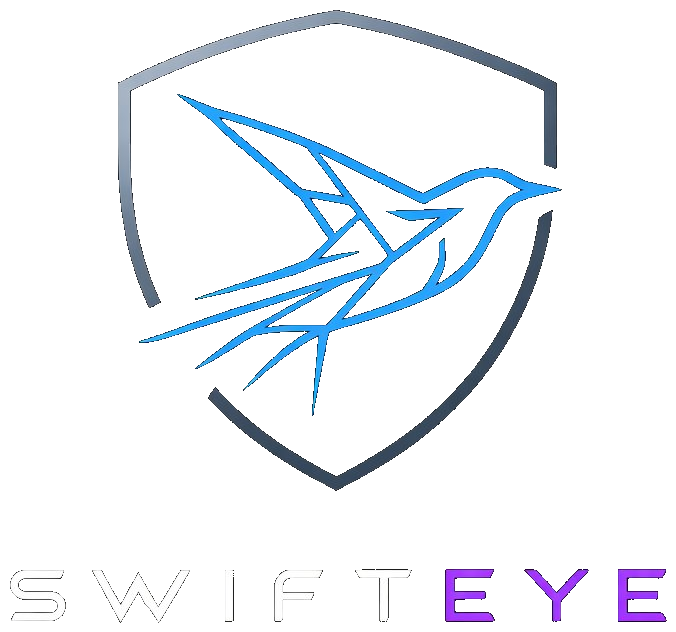

<p align="center">
  
</p>

<h1 align="center">SwiftEye</h1>
<p align="center">Network traffic visualization for security researchers.</p>

---

Drop a `.pcap` or `.pcapng` file, get an interactive force-directed graph of who talked to whom, over what protocols — with full session reconstruction, protocol dissection, TLS fingerprinting, an extensible plugin system, and a Wireshark-style display filter.

## Quick Start

**Prerequisites:** Python 3.10+, Node.js 18+

```bash
cd swifteye
pip install -r requirements.txt

cd backend
python server.py
```

Open **http://localhost:8642** and drop a pcap file.

---

## What You See

- **Force-directed graph** — nodes are IPs/subnets, edges coloured by protocol. Each unique protocol between two nodes gets its own edge. Click a node or edge for detail, shift+click for multi-select with scoped statistics.
- **Protocol detection** — ~90 well-known port mappings plus payload-based detection for TLS, HTTP, SSH, SMTP, FTP, DHCP, SMB, and more on non-standard ports. Conflicts between port and payload are flagged with a warning.
- **Protocol dissection** — SSH banner version, FTP credentials/filenames, DHCP hostname/vendor class, SMB share paths/filenames, ICMPv4/ICMPv6 type names, DNS queries/answers, HTTP host/method/URI, TLS SNI/version/ciphers.
- **Session reconstruction** — bidirectional flows with initiator tracking (SYN-based), directional traffic bytes, retransmit detection, TCP window stats, seq/ack numbers.
- **TLS details** — SNI, versions, cipher suites, JA3 and JA4 fingerprints. Known JA3 hashes resolved to application names (Firefox, Chrome, curl, Cobalt Strike, etc.) with a red ⚠ badge for known malware.
- **Seq/Ack Timeline** — inline chart in the Session Detail SEQ/ACK tab. Click Run to compute a Plotly scatter of sequence numbers over time — shows retransmits, reordering, and throughput shape.
- **Timeline sparkline** — adjustable bucket size (5s/15s/30s/60s) with range sliders for time filtering. Shared across graph, research, and timeline views.
- **Connection Gantt** — full-width Plotly Gantt of all sessions in the Timeline page. Click Run to render.
- **Search** — universal keyword search filters both the graph and Sessions panel. Matches IPs, MACs, hostnames, protocols, ports, and TCP flags simultaneously.
- **Display filter bar** — Wireshark-style expression filter. Supports `ip`, `ip.src`, `ip.dst`, `mac`, `hostname`, `protocol`, `port`, `bytes`, `packets`, `tls.sni`, `http.host`, `dns`, `os`, `private`, `subnet` fields with `==`, `!=`, `>`, `<`, `contains`, `matches`, `&&`, `||`, `!`, `()` and CIDR notation. Client-side, instant feedback.
- **Graph Options** — Subnet grouping (/8–/32 prefix), Merge by MAC (dual-stack IPv4+IPv6 hosts become one node), Show IPv6 toggle, Show hostnames toggle. Right-click any subnet node → **Uncluster subnet** to expand just that subnet.
- **Node detail** — IPs, MACs with vendor name (Apple, Cisco, Intel, Espressif, etc.), TTLs, OS fingerprint, DNS hostnames, connections by direction, plugin sections.
- **MAC vendor lookup** — ~700 OUI prefixes covering major vendors.
- **OS filter** — Clickable OS chips in the FilterBar inject `os contains "..."` expressions.
- **Annotations** — Right-click empty canvas, node, or edge → Add annotation. Pinned HTML labels, persist across reloads.
- **Research page** — full-screen parameterized Plotly charts computed server-side. Scoped by shared time slider.
- **Analysis page** — graph-wide analyses: Node Centrality (ranked table with degree, betweenness, traffic score) and Traffic Characterisation (foreground/background/ambiguous session classification with evidence). Additional researcher analyses render automatically.
- **Investigation notebook** — markdown editor with live preview for documenting findings. Paste screenshots from clipboard, embed images, export as a formatted PDF report.
- **Visualize (BETA)** — upload any CSV/TSV/JSON data and map columns to a force-directed graph. Supports edge label/color/weight, node color/size/group, hover data, and optional timestamp filtering. Works without a loaded capture.
- **Synthetic nodes/edges** — Right-click canvas → Add synthetic node/edge. Hypothesis elements with dashed rendering and ✦ markers. Persisted to backend.
- **Payload preview** — hex+ASCII dump of the first payload bytes per packet in the Session Detail Payload tab.
- **PCAP export** — "Export pcap" button downloads the current filtered view.
- **Dark / light mode.**

---

## Insight Plugins

| Plugin | What It Does |
|--------|-------------|
| **OS Fingerprint** | Passive OS detection from SYN/SYN+ACK characteristics (TTL, window size, MSS, TCP options). |
| **TCP Flags** | Sender attribution — who initiated, accepted, closed, and reset each connection. |
| **DNS Resolver** | Maps IPs to hostnames from captured DNS responses. Hostnames become node labels (cyan). |
| **Network Map** | ARP table reconstruction, gateway detection (diamond node shape), LAN host identification, hop estimation. |
| **Node Merger** | Merges IPs sharing a MAC address (including IPv4+IPv6 dual-stack pairs) into one node before graph building. |

**Writing insight plugins requires Python only.** See developer docs.

---

## Analysis Plugins

Graph-wide computations on the **Analysis ✦** page. Researchers add new analyses by writing a Python file — no frontend needed.

| Analysis | What It Does |
|----------|-------------|
| **Node Centrality** | Degree, betweenness (Brandes), and traffic-weighted ranking. Dedicated interactive panel with sort, search, click-to-select. |
| **Traffic Characterisation** | Classifies sessions as foreground (interactive) / background (automated) / ambiguous. Evidence-based scoring with expandable per-session explanation. |

---

## Visualize (BETA)

Upload any **CSV, TSV, or JSON** tabular data and map columns to a force-directed graph. No capture needed — accessible from the upload screen.

Map columns to: source node, target node, edge label/color/weight, node color/size/group, hover data, and an optional timestamp for time-based filtering. Useful for certificate chains, AD trust relationships, firewall rules, BGP paths, or any relational data.

---

## Research Charts

Click **Research** in the left panel. Use the time scope slider to restrict to a window, then click **Run** on each chart.

| Chart | Question answered |
|-------|-----------------|
| **Conversation timeline** | Who talked to this IP, when, and on what protocol? |
| **TTL over time** | Did the TTL between two peers stay consistent? |
| **Seq/Ack Timeline** | What do sequence numbers look like over the session? (also in Session Detail → SEQ/ACK tab) |
| **HTTP User-Agent timeline** | Which source IPs made HTTP requests, when, and with what User-Agent? |

The Session Gantt lives in the **Timeline** nav entry.

**Tip:** Right-click any node → **Investigate** — the investigated IP pre-fills all Research chart IP fields automatically.

---

## Filtering — Three Layers

1. **Backend filters** — IP, port, search, protocol checkboxes, time range, subnet grouping, merge options. Each change re-fetches from the server.
2. **Display filter bar** — Wireshark-style expressions evaluated client-side. Non-matching nodes/edges dim to 5% opacity. No re-fetch.
3. **Investigation mode** — Right-click a node → Investigate. Dims everything outside the connected component.

---

## Researcher Metadata

Click **META** in the toolbar to upload a JSON file:

```json
{
    "10.0.0.1":          { "name": "DC01",       "role": "Domain Controller" },
    "192.168.1.50":      { "name": "web-server",  "notes": "DMZ host" },
    "aa:bb:cc:dd:ee:ff": { "name": "Unknown NIC", "notes": "First seen 2026-03-01" }
}
```

The `name` field becomes the node label. All other fields appear in Node Detail. Metadata is cleared when a new pcap is uploaded.

---

## Changelog

### v0.9.81 — March 2026
- **HTTP User-Agent timeline** — new Research chart. X = time, Y = source IP, colour = User-Agent. Spot automated tools, C2 beacons, and UA spoofing at a glance.
- **SMTP dissector** — EHLO, MAIL FROM, RCPT TO, AUTH, STARTTLS, banner extraction.
- **mDNS dissector** — service discovery: query names, service types, SRV hostnames, TXT records.
- **SSDP dissector** — UPnP discovery: M-SEARCH/NOTIFY, ST, USN, Location, Server.
- **LLMNR dissector** — Link-Local Multicast Name Resolution: queries, answers. Common attack vector in AD environments.
- **DCE/RPC dissector** — payload fingerprinting (`05 00`/`05 01` magic bytes) detects Microsoft RPC on any port including ephemeral. Extracts packet type, interface UUID → service name mapping (~40 known services: DRSUAPI, SAMR, LSARPC, SVCCTL, NETLOGON, WMI, DCOM, etc.), and operation numbers.
- **OUI vendor table expanded** — from ~688 to ~1050 entries focused on Microsoft ecosystem, network infrastructure, VMs, and printers.
- **User-Agent text brighter** — UA strings in SessionDetail were too dim; fixed.
- **Collapse state carries over all sections** — navigating between sessions on the same edge now preserves all collapse states, not just explicitly toggled ones.
- **Generic search matches session fields** — searching "mozilla", "powershell", etc. now finds edges with matching User-Agents, URIs, SSH banners, Kerberos principals, LDAP DNs, and all other session-level fields.

### v0.9.79 — March 2026
- **Kerberos dissector** — new protocol dissector for TCP/UDP port 88. Parses ASN.1 DER to extract message type (AS-REQ/TGS-REP/KRB-ERROR/etc.), realm, client principal (cname), service principal (sname), encryption types offered, error codes. Session aggregation collects all fields. Frontend renders under Application (L5+) with principals in green/blue, encryption types collapsible, errors in red.
- **LDAP dissector** — new protocol dissector for TCP port 389/636. Parses ASN.1 BER to extract operation type (BindRequest/SearchRequest/etc.), bind DN, SASL mechanism, search base DN, search scope, result codes, entry DNs, attribute names. Session aggregation collects all fields. Frontend renders under Application (L5+) with bind DNs, search bases, result entries collapsible, result codes green/orange.

### v0.9.78 — March 2026
- **Bytes/time chart works for all protocols** — the Bytes/time chart in session Charts tab now works for UDP, ICMP, DNS, and any other protocol — not just TCP. Shows cumulative bytes per direction over time. The SEQ/ACK chart remains TCP-only. Previously, both modes required TCP sequence numbers, so non-TCP sessions showed "No TCP sequence data".

### v0.9.77 — March 2026
- **Collapse state carries over between sessions** — when navigating between sessions (via the ← → arrows on an edge), any sections you had open (e.g. Application L5+, DNS) stay open on the next session. New sessions clone the collapse state from the previous session instead of starting with everything collapsed. Previously visited sessions keep their own state.

### v0.9.76 — March 2026
- **TLS section title fix** — removed SNI from the TLS collapse title. Now shows just "TLS 1.2" or "TLS 1.3" instead of "TLS 0x9C01 — hostname". SNI is still displayed inside the section.

### v0.9.75 — March 2026
- **L5+ frontend rendering** — SessionDetail Application (L5+) layer now displays all new directional fields. Each protocol section shows Initiator → and Responder ← sub-headers where applicable:
  - **TLS**: ALPN offered/selected, supported versions, key exchange group, session resumption, full certificate chain (intermediates)
  - **HTTP**: Initiator shows User-Agents, methods, URIs, referers, cookie/auth flags. Responder shows servers, status codes, content types, redirects, set-cookie flag.
  - **SSH**: Directional banners, KEX algorithms, host key types, encryption/MAC algorithms (collapsible per direction)
  - **FTP**: Initiator commands + transfer mode. Responder response codes + banner.
  - **DHCP**: Lease time, server ID, DNS servers, routers, options seen (in addition to existing hostname/vendor/msg_types)
  - **SMB**: Initiator operations as tags, responder NT status codes (green for success, orange for errors)
  - **ICMP**: Per-direction type/code counts, identifiers (hex), payload sizes, payload hex samples (collapsible)
  - **DNS**: Query class badge (shown only when non-IN — highlights CH/ANY queries)

### v0.9.74 — March 2026
- **HTTP enrichment** — extracts User-Agent, Referer, Content-Type, Content-Length, Server, Set-Cookie, Location, Cookie, Authorization per packet. Session aggregates: unique UAs, referers, content types, servers, methods, status codes, URIs, redirect locations, cookies, auth headers. Both scapy and manual parser paths enriched.
- **ICMP enrichment** — extracts original destination IP from unreachable/time-exceeded embedded headers, redirect gateway address, original TTL from time-exceeded. Session aggregates: unique ICMP type names, original destinations, redirect gateways.
- **DHCP enrichment** — extracts lease time (opt 51), server identifier (opt 54), subnet mask (opt 1), router (opt 3), DNS servers (opt 6), relay agent info (opt 82), client identifier (opt 61), all option numbers seen. Session aggregates: lease time (first seen), unique server IDs, DNS servers, routers, all option numbers.
- **FTP enrichment** — detects transfer mode (active via PORT/EPRT, passive via PASV/EPSV). Session aggregates: unique transfer modes, response codes in order.
- All new fields properly aggregated in sessions.py with appropriate types (sets for unique values, capped lists for ordered sequences) and serialized in post-processing.

### v0.9.74 — March 2026
- **L5+ enrichment: dissectors** — HTTP: User-Agent, Referer, Content-Type, Content-Length, Server, Set-Cookie, Location, Cookie, Authorization. ICMP: payload size and hex sample (first 64 bytes). SSH: KEX_INIT parsing for kex/host-key/encryption/MAC/compression algorithms (both directions). TLS: ALPN offered/selected, supported_versions, extensions list, compression methods, key exchange group, session resumption detection, full cert chain. DNS: query class name (IN/CH/ANY).
- **L5+ enrichment: session aggregation** — all new fields aggregated at session level split by initiator (→) / responder (←). HTTP: initiator gets user_agents/methods/uris/referers/has_cookies/has_auth, responder gets servers/status_codes/content_types/redirects/has_set_cookies. ICMP: per-direction type/code counts, identifiers, payload sizes, payload hex samples. SSH: per-direction banners + KEX algorithms. FTP: initiator commands/transfer_mode, responder response_codes/banner. SMB: initiator operations, responder NT status codes. TLS: initiator ClientHello extensions, responder ServerHello details + cert chain.

### v0.9.73 — March 2026
- **Back navigation fix** — canvas background click was double-pushing to history (once from `handleGSel`'s blanket `_navPush()`, once from `clearAll()`). Now `_navPush()` is called per-branch (node/edge only), and the else branch delegates to `clearAll()` which handles its own push. Pressing back after canvas click now correctly restores the previous edge/session/node detail.

### v0.9.72 — March 2026
- **Back/forward navigation fix** — history snapshots now use a `latestRef` that always holds the most recent state values, fixing the stale-closure problem where pressing back after a canvas click would restore the wrong panel state. Dropdown no longer auto-opens on history restore — it only opens when the search input is focused (user actively typing).

### v0.9.71 — March 2026
- **ARP and OTHER are top-level in protocol tree** — no longer incorrectly nested under IPv4. ARP, OTHER, and any non-IP protocol render as flat toggleable rows with color swatches at the root level, alongside IPv4 and IPv6.
- **Transport rows have color swatches** — UDP, TCP, ICMPv6 now show a colored checkbox square (like leaf protocols), making it visually obvious they are clickable/toggleable. Half-filled state when some children are on.
- **Backend: ip_version 0 wildcard** — composite filter keys with ip_version=0 (e.g. `0/ARP/ARP`) match any ip_version in the backend filter, correctly handling non-IP protocols.

### v0.9.70 — March 2026
- **HANDOFF: Logging & auth considerations** — structured JSON logging, request tracing, per-module log levels, performance timing, frontend error reporting, audit log, log rotation. Authentication options from simplest to most capable: shared token, local accounts, LDAP/AD, SSO/OAuth2, API keys — with pros, cons, and when each fits.

### v0.9.69 — March 2026
- **HANDOFF: Architecture plans documented** — Section 7 (Multi-source ingestion & scale: EventRecord abstraction, 4 storage backend options with pros/cons/scale ceilings, phased recommendation, Splunk integration specifics), Section 8 (Team boundaries & code decoupling: 5 coupling problems with fixes, coupling matrix, refactoring priority table), Section 9 (Long-term considerations: testing/CI, state persistence, frontend performance cliffs, plugin versioning, data lineage, collaboration models, export/reporting).
- **Roadmap: L5+ protocol enrichment** — per-protocol field extraction targets for DNS, DNSSEC, TLS, HTTP, SSH, FTP, DHCP, SMB, ICMP, and new protocols (SMTP, Kerberos, mDNS, SSDP).

### v0.9.68 — March 2026
- **Legend fix** — protocol names in the graph legend are now deduplicated from composite keys. `4/UDP/DNS` and `6/UDP/DNS` both show as a single "DNS" with its color swatch. No more duplicate or raw composite key labels.
- **ARP/ICMPv6/OTHER no longer show "Other" subcategory** — when a transport has only one leaf and that leaf is the transport itself (ARP/ARP, ICMPv6/ICMPv6), the tree shows just the transport row as a toggleable leaf without expanding into an "Other" child.

### v0.9.67 — March 2026
- **Back/forward panel navigation** — browser-style arrow buttons (left/right) appear at the top of the right panel when navigation history exists. Every panel change (clicking a node, edge, session, switching panels, escaping) pushes the current state to a history stack. Click back to return to the previous view, forward to go ahead again. History capped at 50 entries. Uses refs to avoid re-renders. Restoring a snapshot sets selNodes, selEdge, selSession, rPanel, and search text.

### v0.9.66 — March 2026
- **Offline-safe CDN fallbacks** — Google Fonts and Plotly.js CDN links kept in index.html for when internet is available. Font CSS variables now include system font fallbacks (ui-monospace, Cascadia Code, SF Mono, Consolas for mono; system-ui, Segoe UI, Roboto for display) so the UI renders correctly offline instead of falling back to serif. Plotly.js added to package.json as local dependency and imported in main.jsx, so Vite bundles it — works offline after npm install.
- **Escape and canvas click clear search** — pressing Escape or clicking the canvas background now clears the search text (and its dimming) in addition to clearing the selection. New `clearAll()` function handles both. Panel switches and other navigation still only clear selection, not search.

### v0.9.65 — March 2026
- **Roadmap: investigation notes aggregation** — the Investigation panel's Markdown editor will get a sidebar showing all notes from nodes/edges/sessions as clickable reference cards with "Go to" and "+ Add to timeline" actions.
- **Roadmap: projects and workspaces (long-term)** — user workspaces containing projects, each with sub-projects (capture analyses, standalone visualizations). Project-level investigation spans all sub-projects. Multi-capture correlation across sub-projects.

### v0.9.64 — March 2026
- **Session ID is now the reference hash** — the user-facing Session ID in the Advanced section is the 16-char FNV-1a reference hash (e.g. `82d0ceb66f6ceb99`). The internal key (e.g. `192.168.1.104|224.0.0.251|5353|5353|UDP`) is shown below as "Internal key". Hash computation moved to shared `sessionRefHash()` utility in utils.js.

### v0.9.63 — March 2026
- **Collapse state persistence** — sections you open in a session detail are remembered. Navigate away and come back: they're still open. New sessions start all-collapsed. Uses React Context (CollapseContext) with a per-session Map stored in useCapture. Notes section auto-opens when existing text is loaded.

### v0.9.62 — March 2026
- **All sections start collapsed** — SessionDetail opens with everything collapsed. User expands what they need. Navigating to a different session resets all collapse states (via React key on SessionDetail). Notes section auto-opens when existing note text is loaded.
- **Search clears selection** — changing the search text now clears the previous node/edge/session selection, preventing old highlights from persisting when searching for something new.

### v0.9.61 — March 2026
- **Search dropdown (Option D)** — typing in the search bar shows a dropdown with categorized results (Nodes / Edges). Each result shows what matched (hostname, tls_sni, ja3, protocol, etc.) in green. Click a result to select it on the graph and open its detail in the right panel. Dropdown closes on click-outside or when search is cleared.
- **Charts tab crash fixed** — Notes section was accidentally inside the SeqAckChart component, causing a crash when switching to the Charts tab.
- **Search precision improved** — DNS queries removed from edge matching (too noisy). No cascade from matched edges to endpoints.
- **All SessionDetail sections open by default** — all collapsible sections now start expanded.
- **EdgeDetail duplicate Notes removed**.

### v0.9.60 — March 2026
- **Search no longer propagates edge→node** — only directly matched nodes and their edges highlight. Matched edges highlight but their endpoints no longer light up, preventing the cascade where a DNS edge matching "cert" would light up the DNS server and then all its other connections.
- **Session Advanced section enriched** — shows session ID, start/end time (ISO 8601), and a unique hash for reference.

### v0.9.60 — March 2026
- **Search precision fix** — removed DNS query matching from edges (one DNS edge aggregates hundreds of unrelated queries, causing false positives like "cert" matching every DNS edge). DNS matching now works through node hostnames only, which are precise. Searching "cert" now highlights only `cert.ssl.com` and its direct connections.
- **Layer headers visually distinct and collapsible** — Network (L3), Transport (L4), Application (L5+) headers in Session Detail use a new `level="layer"` prop on Collapse: larger font, brighter color (`--tx` instead of `--txM`), top margin and bottom border. Clearly distinguishable from inner section headers. Fully collapsible.
- **Session Advanced enriched** — shows session ID, start/end timestamps (ISO 8601), and a 16-char FNV-1a reference hash.

### v0.9.59 — March 2026
- **Search cascade fix** — searching no longer flood-fills the graph. Previously, a matched node lit up its edges, whose other endpoints also lit up, cascading across the graph. Now: matched nodes highlight their edges (but not the other endpoint), matched edges highlight their endpoints (but don't cascade further). Searching "cert" now highlights only `cert.ssl.com` and its direct edges.
- **Search clear button** — X button appears in the search box when text is present.

### v0.9.58 — March 2026
- **Layer sections collapsible** — Network (L3), Transport (L4), and Application (L5+) section headers in Session Detail are now collapsible `<Collapse>` wrappers instead of static labels. Click to expand/collapse an entire layer.

### v0.9.57 — March 2026
- **Notes on sessions and edges** — collapsible Notes section added to SessionDetail and EdgeDetail (same pattern as NodeDetail). Notes are stored as annotations with `session_id` or `edge_id`, persisted to backend.
- **Help popup scrollable** — the display filter syntax popup (`?` button) now scrolls within the viewport instead of overflowing off-screen.

### v0.9.56 — March 2026
- **Session Detail layer organization** — OVERVIEW tab reorganized by network layer: General (packets/bytes/duration/direction) → Network L3 (TTL, IPv4/IPv6 header) → Transport L4 (ports, TCP reliability, window size, TCP flags, seq/ack, TCP options) → Application L5+ (TLS, HTTP, DNS, SSH, FTP, DHCP, SMB). Advanced section kept at bottom for session ID and future use. UDP sessions show ports under Transport L4. Layer headers only appear when relevant data exists.

### v0.9.55 — March 2026
- **Protocol hierarchy: per-IP-version filtering** — toggling a transport branch (e.g. UDP under IPv6) only affects that IP version, not both. Composite filter keys (`4/TCP/HTTPS`, `6/UDP/DNS`) sent to backend via new `protocol_filters` parameter. "Other" label for unresolved transport-only packets (replaces the removed synthetic "Other TCP" entries). Double-click any protocol to solo it.
- **Client-side search: field name matching** — searching "ja3" now highlights all edges that have JA3 fingerprints. Searching "dns" highlights DNS edges, "tls" highlights TLS edges, etc. Previously only matched against field values, not names.

### v0.9.54 — March 2026
- **Client-side search** — the search box now evaluates instantly against all node/edge fields (IPs, MACs, hostnames, OS, JA3/JA4, TLS SNI, HTTP host, DNS queries, cipher suites, metadata). Non-matching elements are dimmed, not removed. No backend re-fetch.
- **Protocol hierarchy** — the flat protocol list is now a collapsible tree: IPv4/IPv6 → Transport → Application protocol. Click branches to toggle all children. "Other TCP"/"Other UDP" for unresolved transport-only packets.
- **Address type annotation** — each IP in NodeDetail now shows a colored badge: Private, Loopback, APIPA, Multicast, Broadcast, CGNAT, Documentation, ULA, Link-local.
- **Enhanced DNS dissection** — query type names (A/AAAA/CNAME/MX/…), response codes (NOERROR/NXDOMAIN/SERVFAIL), structured answer records with per-record type, data and TTL, authority/additional sections, DNS flags (AA/TC/RD/RA), transaction IDs.
- **Payload entropy** — Shannon entropy per packet in the Payload tab, classified as structured/text/mixed/compressed/encrypted with color-coded badges.
- **OS filter finds gateway nodes** — gateways detected by Network Map get `os_guess = "Network device (gateway)"` overriding the OS fingerprint. The OS fingerprint details remain in the plugin section.
- **Show IPv6 OFF + Merge by MAC fixed** — external IPv6 nodes that were only reachable through a merged dual-stack host are now correctly hidden when "Show IPv6" is toggled off.

### v0.9.38 — March 2026
- **Backend gap collapsing** — `build_time_buckets()` now replaces large empty runs (>1 day AND >20% of capture duration) with a single `is_gap=True` marker bucket. A 3-day gap between two pcaps becomes one bucket instead of 260,000.
- **Sparkline gap rendering** — `is_gap` buckets are drawn as diagonal `////` hatch lines instead of bars.
- **Burst detection uses gap markers** — `detectBursts()` splits on `is_gap` buckets directly, no gap-scanning loop needed.
- **Bucket size restrictions removed** — no longer needed since the backend never returns excessive buckets.

### v0.9.38 — March 2026
- **Timeline: gap-split sparkline.** Burst segments fill real screen space; large gaps show as //// hatch with duration. No bucket selector, no state. Sliders span global range. Full DD/MM/YYYY timestamps.

### v0.9.37 — March 2026
- **Timeline: fine bucket sizes disabled in All view when capture is too long.** A 3-day capture at 1s = 260,000 buckets — crashes backend + frontend. Bucket buttons that would produce >5000 buckets in All view are now dimmed and unclickable. Burst view is never restricted (bursts span minutes at most).

### v0.9.36 — March 2026
- **Timeline: burst view slices sparkline.** Clicking Burst N now shows only that burst's bars filling the full sparkline width. Sliders go 0→N_burst, reset to full range on burst click.
- **Timeline: full date+time** — timestamps now show DD/MM/YYYY HH:MM:SS.
- **Timeline: 1s crash fixed** — burst detection loop moved into TimelineStrip component, runs only when timeline changes, not on every parent render.

### v0.9.35 — March 2026
- **Timeline: full revert to original architecture.** Deleted `TimelineStrip.jsx`. Logic is now inline in `App.jsx` inside an IIFE — same as the original v0.9.0 strip, with two additions: (1) timestamps on sliders, (2) burst snap buttons. No state, no effects, no components, nothing to crash.

### v0.9.34 — March 2026
- **Timeline: Option B** — full sparkline always visible, sliders span full 0..N-1, burst buttons snap sliders. No viewport state, no useEffect, nothing to crash.
- **Burst detection: real-time thresholds** — gap must be >20% of total capture duration AND >60 seconds. A 20s capture never splits; two pcaps hours apart always produce two bursts.
- **Burst buttons only shown when 2+ bursts** — single-session captures show no burst UI at all.

### v0.9.33 — March 2026
- **Timeline rewrite (stable)** — replaced viewport state with `activeBurst` index. No state that calls `setTimeRange` inside effects. No feedback loops possible. Burst buttons, All button, and bucket-size changes all update `activeBurst`; viewport is purely derived.

### v0.9.32 — March 2026
- **Black screen fix** — `useEffect([timeline])` caused an infinite loop: clicking "All" triggered a re-render → new timeline reference → effect fired again → `setTimeRange` → re-render → repeat. Fixed by using `N` (bucket count) as dep with a `prevN` ref guard that skips the initial mount.

### v0.9.31 — March 2026
- **Timeline: viewport resets on bucket size change** — changing 1s/5s/15s etc. now re-snaps viewport and range to first burst.
- **Timeline: All button always visible** — no longer hidden when in full view; has active styling when selected.
- **Timeline: black screen fix** — Sparkline now guards against zero/invalid width and viewport values.

### v0.9.30 — March 2026
- **Timeline redesign** — burst detection + zoom view + original Start/End sliders combined. Burst buttons zoom the sparkline to that region; sliders operate within the zoomed viewport; "All" resets both.

### v0.9.29 — March 2026
- **Sparkline: viewport auto-pan while dragging** — when painting a range by dragging near the canvas edge, the viewport now scrolls automatically so you can reach burst 2 from burst 1 without releasing.
- **"Full" renamed to "Overview"** — always visible alongside burst buttons; highlights when active.
- **Timeline timestamps fixed** — container set to overflow:hidden, preventing layout overflow from hiding the timestamp row.

### v0.9.28 — March 2026
- **Traffic panel: show all rows** — searching by IP no longer hard-caps at 30 rows. "Show all N" button appears when results exceed the default limit.
- **Traffic panel: filtered percentages** — fg/bg/ambiguous counts update to reflect the current IP filter. Shows `filtered/global` when a filter is active.
- **ARP = background** — ARP sessions are now unconditionally classified as background (address resolution, always automated).
- **Node Centrality: global rank preserved** — the `#` column always shows the original score rank regardless of the active filter or sort order. Score column added.
- **Sparkline fixed** — was treating bucket objects as raw numbers instead of reading `.packet_count`. Now renders correctly.

### v0.9.27 — March 2026
- **Timeline A+B+E** — scroll-to-zoom main view, minimap overview, burst detection + jump buttons, auto-crop to first burst on load, right-click to reset.
- **Analysis IP search** — both Node Centrality and Traffic Characterisation have an IP filter bar with optional second IP for session filtering.
- **Traffic evidence rows** — click any session row in Traffic Characterisation to expand and see the exact signals (fg/bg scores + per-signal explanation) that drove the classification.
- **Help panel updated** — Analysis panel documented, lasso/relayout/cluster added to Graph Interactions, new Timeline Strip section.

### v0.9.26 — March 2026
- **Hotfix** — `build_graph()` was missing `mac_split_map` from its parameter list (added to internal code but not the `def` signature), causing `TypeError` on every `/api/graph` request.

### v0.9.25 — March 2026
- **Interactive timeline** — click directly on the sparkline to set start, drag to paint a range, drag handles to adjust boundaries, right-click to reset to full. Start handle is blue, end handle is green. Range timestamps shown top-right of strip.

### v0.9.24 — March 2026
- **Freehand lasso** — Shift+right-drag now draws a freehand polygon (not a box). Point-in-polygon hit test on release.
- **Relayout button moved** — bottom-right to avoid overlapping the "N nodes hidden" badge.
- **Timeline resolution** — added 1s bucket size. Slider now shows actual timestamps (HH:MM:SS) instead of bucket indices.
- **Node label threshold** — new Graph Options slider. Hide labels below 1KB/10KB/100KB/1MB/10MB of traffic. Hover always shows label.
- **Roadmap** — added: IP address type annotation in NodeDetail (private/APIPA/multicast/etc), NetworkX backend for large-graph centrality.

### v0.9.23 — March 2026
- **Same IP, different MACs = different nodes** — `build_mac_split_map()` detects IPs seen with multiple distinct source MACs; those hosts get `ip::mac` node IDs so they render separately instead of collapsing.
- **Node Centrality panel** — live computation: degree, Brandes betweenness, traffic volume. Sortable table, click row to select node on graph.
- **Traffic Characterisation panel** — classifies every session as foreground/background/ambiguous using duration, pps, bytes-per-packet, and TCP flags. Filter + stacked summary bar.
- **Analysis panel redesign** — panels expand to half-page on click, side by side. LLM section clearly labelled as the only external-API feature.

### v0.9.22 — March 2026
- **Playback fully removed** — all playback state, tick effect, and control functions removed from `useCapture.js`. Timeline strip is the original Start/End range sliders only.

### v0.9.21 — March 2026
- **Architecture audit** — hooks ordering, dead code removal, AnalysisContext parity, API key persistence.

### v0.9.20 — March 2026
- **Code audit** — hooks ordering fixes (StatsPanel, EdgeDetail), lasso+contextmenu conflict fix, README backfilled.

### v0.9.19 — March 2026
- **Investigate split** — "Investigate neighbours" (depth-1) and "Investigate component" (full BFS).
- **Relayout button** — unpins all nodes and reheats force simulation for a clean layout.
- **Lasso select** — Shift+right-drag to draw a selection rectangle.
- **Synthetic cluster** — cluster selected nodes into one visual node; edges rerouted automatically.

### v0.9.18 — March 2026
- **Analysis panel** — "Analysis ✦" nav item with Coming Soon cards and LLM interpretation skeleton (API key input, model selector, disabled button).
- **Subnet recluster bug fixed** — exclusions now cleared when subnet grouping is toggled off.

### v0.9.17 — March 2026
- **Timeline strip reverted** — playback controls removed, original Start/End sliders restored.

### v0.9.16 — March 2026
- **Gateway filter** — new display filter fields: `gateway` (bare flag) and `role == "gateway"/"lan"/"external"` sourced from Network Map plugin.

### v0.9.15 — March 2026
- **Multi-pcap** — drop or select multiple .pcap files; merged by timestamp.
- **dpkt parity** — raw-byte DNS, FTP, DHCP, SMB dissectors for ≥500MB files.

### v0.9.14 — March 2026
- **TLS version in session title** — TLS collapse now reads "TLS 1.2 — milvus.io".
- **Help panel tabbed** — Guide + Plugins & Protocols tabs.

### v0.9.13 — March 2026
- **Black screen on node click fixed** — `useEffect` missing from NodeDetail imports.

### v0.9.12 — March 2026
- **TLS Certificate extraction fixed** — loop now walks full handshake chain.
- **JA3 smaller dots**, initiator/responder in tooltip. **JA4 timeline** added.

### v0.9.11 — March 2026
- **Network Map plugin crash fixed**, notes not persisting fixed, notes moved to bottom.

### v0.9.10 — March 2026
- **Canvas theme not updating fixed** — `theme` prop + 20ms delay useEffect.
- **Pastel theme**, **gateway diamond nodes**, **legend theme-aware**.

### v0.9.10 — March 2026
- **Pastel theme** — soft lavender/violet UI, mint/rose accent colors, easy on the eyes.
- **Gateway nodes as diamonds** — routers/gateways detected by the Network Map plugin render as diamonds in the graph, with their own legend entry and per-theme color.
- **Legend theme-aware** — legend swatches now use CSS variables, always in sync with the active theme.

### v0.9.9 — March 2026
- **Full theme system** — themes now affect the graph canvas, node colors (private/external/subnet), and edge colors, not just the UI chrome. Each theme has its own node palette. Canvas reads CSS variables at render time.
- **Canvas vignette** — subtle radial gradient gives the canvas depth.

### v0.9.8 — March 2026
- **Network Map plugin** — passive topology detection: gateways (via dst_mac analysis), LAN hosts (ARP + TTL), hop counts (TTL-based), ARP table. Shows "Network Role" in NodeDetail with coloured badge.
- **IPv4 Header fields split by direction** — initiator and responder shown separately with all flags, IP ID range, DSCP, ECN per side.

### v0.9.7 — March 2026
- **Session navigator** — ‹ / › arrows in SessionDetail to move between sessions on the same edge, ordered by start time with `#N / #M` index.
- **TLS Certificate extraction** — subject CN, issuer, validity dates, SANs, serial number extracted from Certificate handshake and shown in TLS collapse.
- **Two new research charts** — DNS Query Timeline (domain × time, colour = rcode) and JA3 Fingerprint Timeline (remote IP × time, colour = JA3, size = bytes).
- **Charts tab** — renamed from `seq/ack`, moved after Payload.
- **Settings panel** — ⚙ button opens persistent settings. Seven themes: Dark, Dark Blue, OLED Black, Colorblind, Blood, Amber, Synthwave.

### v0.9.6 — March 2026
- **IPv4 Header section enriched** — DF/MF flags, fragmentation observed, IP ID range (hex + decimal), DSCP/QoS with named values. Shown for every IPv4 session, not just when values are non-zero.

### v0.9.5 — March 2026
- **Notes on every node** — collapsible Notes section in NodeDetail for all nodes. Free-text, persisted as annotations with `annotation_type: "note"`, survive graph re-fetches.
- **Synthetic node editing** — inline editable label, IP, and color in NodeDetail when a synthetic node is selected. PUTs immediately.
- **Synthetic node size fixed** — synthetic nodes now render at a meaningful size (default 14px radius) instead of the minimum.

### v0.9.4 — March 2026
- **Seq/Ack chart: Bytes/time + SEQ/ACK modes** — toggle between throughput view (lines, slope = throughput) and SEQ-vs-ACK scatter. Legend moved below chart.
- **SEQ/ACK tab auto-widens panel** to 500px for readability.
- **IPv4/IPv6 Header collapse** in session overview — DF flag, DSCP (named), ECN (decoded), IPv6 flow label. Aggregated from all packets in session.
- **Payload tab redesigned** — ASCII-only by default, Hex toggle, per-packet copy buttons (ASCII / Hex / Raw).
- **IP header fields per packet** — TTL, DF/MF, DSCP, ECN, TCP checksum inline on each payload packet row.
- **ISN per direction** in Advanced section.
- New `PacketRecord` fields: `ecn`, `ip_checksum`, `tcp_checksum`, `ip6_flow_label`.

### v0.9.3 — March 2026
- **Payload tab "Raw bytes" toggle** — hex dump hidden by default, toggle to reveal. Each packet row shows IP header fields inline: TTL, DF/MF, DSCP, ECN, flow label (IPv6), TCP checksum.
- **IP/IPv6 header fields extracted** — ECN, DSCP, IP checksum, TCP checksum, IPv6 flow label now in `PacketRecord` and exposed via the session detail API.
- **ISN per direction in Advanced** — initial sequence numbers for initiator and responder shown in Overview → Advanced, giving context for the relative seq/ack chart.
- **Seq/Ack chart redesigned** — relative SEQ vs time instead of raw SEQ vs ACK. Readable chart showing throughput slope, stalls, retransmits.
- **Empty protocol swatch fixed** — nameless protocol entry in left panel removed.
- **FLAGS tab removed** — flag counts consolidated into Overview → Advanced.

### v0.9.2 — March 2026
- **Merge-by-MAC gateway bug fixed** — external connections no longer collapse after merge. Root cause: `dst_mac` (the gateway MAC) was used in merge groups, causing all external IPs to union-find together. Fixed with src_mac-only + router vendor OUI check + group size cap at 8.
- **NodeDetail: IPs and MACs always visible** — no longer hidden in Advanced. MACs show vendor inline: `c4:d0:e3:8f:6b:69 (Apple)`.
- **JA3/JA4 inline** — app name on the same line as the hash. SessionDetail now uses `JA3Badge` (previously plain text, no app lookup).

### v0.9.1 — March 2026
- **App.jsx refactor** — All state/logic extracted to `useCapture()` hook. App.jsx is pure layout. Eliminates root cause of spurious re-renders (graph wiggle on click).
- **Single version source** — `version.js` is the only place to update version. No more drift.
- **Seq/Ack Timeline in Session Detail** — New SEQ/ACK tab with Run button. Plotly chart inline, no need to navigate to Research.
- **Show Hostnames toggle** — Graph Options toggle to switch between DNS names and raw IPs on node labels.
- **IPv6 connections preserved after merge** — Fixed: `include_ipv6=False` filter was applied before entity resolution, dropping merged-IPv6→IPv4 source packets. Now resolved IPs are checked.
- **scapy used for all files <500MB** — Previously dpkt was used for files ≥20MB, silently breaking DNS hostname resolution, TLS dissection, and all scapy-layer dissectors. dpkt is now only a fallback for files ≥500MB.
- **mac_vendors fixed** — Was never populated due to lookup never being called. Now derived from sorted MACs at serialisation time — parallel array guaranteed correct.
- **JA3 duplicate hashes fixed** — 10 hashes were listed twice: once as a browser/library, once as malware. Real browser hashes (Chrome, Safari, LibreSSL, Tor) were being overwritten with malware labels.
- **8 malformed OUI keys removed** — Keys with 7–8 hex digits that would never match.
- **Annotations/synthetic/metadata cleared on new upload** — Previously bled over from the previous capture.
- **Upload screen larger** — Drop zone 460px, logo 120px.
- **Dozens of smaller bug fixes** — See HANDOFF.md for the full list.

### v0.9.0 — March 2026
- **Dual-stack merge preserves all connections** — IPv4+IPv6 addresses sharing a MAC correctly merge into one node. EdgeDetail session matching now checks all IPs of a merged node.
- **Seq/Ack Timeline chart** — New Research chart.
- **Research panel error boundary** — ChartErrorBoundary prevents one chart crash from blanking the panel.

### v0.8.8 — March 2026
- **Graph no longer wiggles on click** — Memoised `visibleNodes`/`visibleEdges` so simulation doesn't restart on selection changes.

### v0.8.7 — March 2026
- **MAC vendor lookup** — NodeDetail shows vendor name after each MAC (Apple, Cisco, Intel, VMware, Espressif, etc.).
- **JA3 → app name** — Known JA3 hashes resolved to application names. Green badge for legit apps, red ⚠ for known malware.
- **Error isolation** — Dissector and node merger exceptions logged, never crash the graph endpoint.

### v0.8.6 — March 2026
- **SSH dissector** — Banner version and software fingerprint.
- **FTP dissector** — Commands, usernames, filenames, credential detection.
- **DHCP dissector** — Hostname (Option 12), vendor class (Option 60), message type.
- **SMB dissector** — SMBv1/v2/v3, share paths, filenames, NT status codes.
- **ICMPv6 dissector** — NDP types (NS/NA/RA/RS), echo, errors. ICMPv6 no longer classified as OTHER.

### v0.8.5 — March 2026
- **Sessions panel local search** — Independent search inside the Sessions panel.
- **Search scope badge** — Sessions nav item shows `12/381` when search is active.

### v0.8.4 — March 2026
- **Merge-by-MAC fixed** — Multicast IPs/MACs excluded from merging.

### v0.8.3 — March 2026
- **Payload preview** — Hex+ASCII dump in Session Detail Payload tab.
- **Hide node** — Right-click → Hide node. Badge with Unhide all.
- **Retransmission detection** — Retransmits, out-of-order, dup-ACK per session and globally.
- **PCAP export** — "Export pcap" button for the current filtered view.
- **Seq/Ack Timeline** — Research chart and Session Detail link.

### v0.8.0–v0.8.2 — March 2026
- Help page, payload preview, research IP pre-fill, annotation/synthetic fixes.

### v0.7.x — March 2026
- JA3/JA4 fingerprinting, dpkt fallback, Wireshark display filter, investigation mode, subnet uncluster, Timeline page, annotations, synthetic nodes/edges, universal search.
